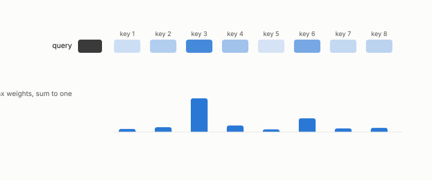

# softmax

**id.** softmax
**kind.** concept

## definition

The function that exponentiates a list of numbers and divides by their sum, so that they are positive and add to one. Equation 0.23.

## equation

Book equation 0.23.

    \operatorname{softmax}(z)_i=\frac{e^{z_i}}{\sum_j e^{z_j}},\qquad \text{output}=\sum_i\operatorname{softmax}\!\Big(\frac{q\cdot k_i}{\sqrt{d}}\Big)_{\!i}\,v_i.

## conditions

- The softmax exponentiates a list of scores and divides by the sum, so the weights are positive and add to one. Adding the same constant to every score leaves it unchanged, and a larger score gets a larger weight.
- As a consumer it reads the scores through their differences, which is why the two proxies for softmax-KL in the ledger, the variance ratio and the projected-variance trace, were refuted.

Conditions are curated in `entries.toml` rather than read from a record.

## ledger

- *refutes or corrects.* NEG-8 `[refuted]`. The Var-ratio tang_qproj is a ≥0.9-Spearman rank proxy for softmax-KL under every consumer. [`geometric-observation/claims/LEDGER.md:101`](https://github.com/ahb-sjsu/geometric-observation/blob/d1f8988/claims/LEDGER.md#L101).
- *refutes or corrects.* NEG-9 `[refuted]`. The projected-variance trace tr(P_C·Σ_δ) is a complete rank statistic for softmax-KL across all arms. [`geometric-observation/claims/LEDGER.md:102`](https://github.com/ahb-sjsu/geometric-observation/blob/d1f8988/claims/LEDGER.md#L102).

## first stated

Chapter 0 section 0.11 of *Data Mining as Observation*, with the program's softmax reader in `turboquant-pro/docs/KV_KEYS_FINDING.md:1-49`.

## measurements

| Where the book states it | Numbers, as the book's sources table records them | Source |
|---|---|---|
| chapter 2 section 2.5 | cosine 0.995 and the softmax reader | [`turboquant-pro/docs/KV_KEYS_FINDING.md:1-49`](https://github.com/ahb-sjsu/turboquant-pro/blob/856c4cb/docs/KV_KEYS_FINDING.md#L1-L49) |

## failures and corrections

- NEG-8, `[refuted]`. The Var-ratio tang_qproj is a ≥0.9-Spearman rank proxy for softmax-KL under every consumer. [`geometric-observation/claims/LEDGER.md:101`](https://github.com/ahb-sjsu/geometric-observation/blob/d1f8988/claims/LEDGER.md#L101).
- NEG-9, `[refuted]`. The projected-variance trace tr(P_C·Σ_δ) is a complete rank statistic for softmax-KL across all arms. [`geometric-observation/claims/LEDGER.md:102`](https://github.com/ahb-sjsu/geometric-observation/blob/d1f8988/claims/LEDGER.md#L102).

## machine checked

`lean/DataMiningAsObservation/Softmax.lean`, theorems `denom_pos`, `softmax_pos`, `softmax_sum`, `softmax_shift`, `softmax_lt_iff`, at observation-data-mining 08b4794.

## used in

*Data Mining as Observation* chapters 0, 2, 3, 4, 8, 11.

## related

attention, kl-divergence, perplexity, consumer

## see also

Book equations stated beside the entry's terms, not defining it: 0.24.

Sources-table rows that share a record with the entry without naming it: chapter 1 section 1.4, chapter 3 section 3.2, chapter 8 section 8.2, chapter 11 section 11.1, chapter 11 section 11.2.

## status

Generated 2026-09-06 by `encyclopedia/generate.py`; book at observation-data-mining 08b4794; the commit of every record is listed in the encyclopedia's provenance.
