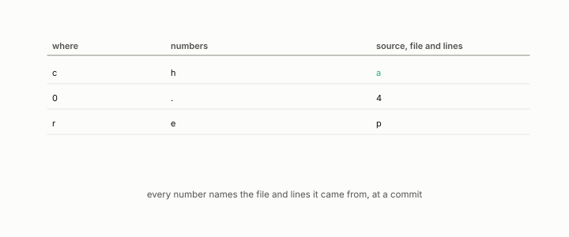

# sources table

**id.** sources-table
**kind.** instrument

## definition

The table at the end of every chapter naming, for each number, the repository, file, and line range it came from. Chapter 0 section 0.21.

**Example.** The row for section 4.2 names readscope/readscope/allocate.py lines 1 to 100 for the water-filling formula.

## equation

none

## conditions

- The table at the end of every chapter naming, for each number, the repository, file, and line range it came from, so that no number in the book has to be taken on trust. A row that names a commit hash binds the number to one state of the file, since a changed digest proves a changed file.
- The table is a citation and not a proof. The book's checker verifies that every cited path exists, and the encyclopedia's checker verifies the numbers of its hand-filled entries against the generated ones, but the numbers themselves are the records' and the reader who wants them opens the file.

Conditions are curated in `entries.toml` rather than read from a record.

## ledger

none

## first stated

Chapter 0 section 0.21 of *Data Mining as Observation*, with the program's claims ledger that the same discipline enforces in `turboquant-pro/CLAIMS.md:1-27`.

## measurements

none

## failures and corrections

none

## invariance envelope

none declared

## machine checked

[`lean/DataMiningAsObservation/Seal.lean`](https://github.com/ahb-sjsu/observation-data-mining/blob/f3914f0/lean/DataMiningAsObservation/Seal.lean), theorems `changed_of_hash_ne`, `hash_eq_of_eq`, `exists_collision`, at observation-data-mining f3914f0; what the check covers is stated in the book's [appendix C](https://github.com/ahb-sjsu/observation-data-mining/blob/f3914f0/chapters/machine_checked.md).

## used in

*Data Mining as Observation* primer S, chapters 0, 1, 2, 3, 4, 5, 6, 7, 8, 9, 10, 11, 12, 13, 14.

## related

commit-hash, sealed, ledger-class, preregistration, certificate

## see also

Book equations stated beside the entry's terms, not defining it: 8.1.

Sources-table rows that share a record with the entry without naming it: chapter 11 section 11.5.

## status

Generated 2026-09-09 by `encyclopedia/generate.py`; book at observation-data-mining f3914f0; the commit of every record is listed in the encyclopedia's provenance.
