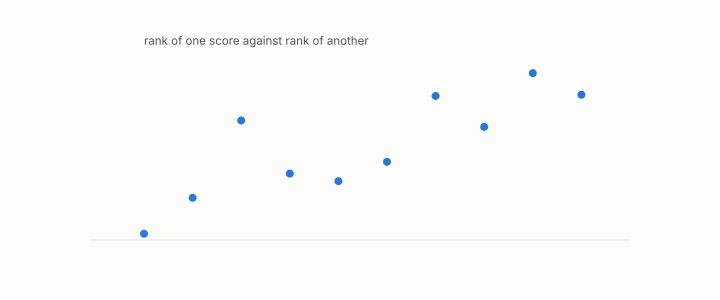

# Spearman correlation

**id.** spearman-correlation
**kind.** concept

## definition

The ordinary correlation between two lists of ranks. Equation 0.14.

**Example.** Ranks (1, 2, 3) against (1, 3, 2) give Spearman correlation 0.5.

## equation

Book equation 0.14.

    \rho_S=1-\frac{6\sum_i d_i^{2}}{n(n^{2}-1)},\qquad d_i=\text{difference of the two ranks of item } i.

## conditions

- The ordinary correlation between two lists of ranks, one minus six times the sum of squared rank differences over n(n² − 1). It is at most one, one when the rankings agree, and minus one for three items in opposite orders, and since ranks depend on the ordering alone a strictly increasing transform of either score leaves it unchanged.
- A high Spearman between a proxy and a consumer's loss is not a certificate. The variance-ratio proxy with Spearman above 0.9 is a refuted ledger row, and the rank certificate's floor on Spearman is the strict setting's guarantee, not a measured correlation.

Conditions are curated in `entries.toml` rather than read from a record.

## ledger

- *refutes or corrects.* NEG-8 `[refuted]`. The Var-ratio tang_qproj is a ≥0.9-Spearman rank proxy for softmax-KL under every consumer. [`geometric-observation/claims/LEDGER.md:101`](https://github.com/ahb-sjsu/geometric-observation/blob/fc6b378/claims/LEDGER.md#L101).

## first stated

Spearman, the proof and measurement of association between two things, 1904, as chapter 0 section 0.9 states it, and the rank statistic of the recognizer battery in the-angular-observer and of the rank certificate in readscope.

## measurements

none

## failures and corrections

- NEG-8, `[refuted]`. The Var-ratio tang_qproj is a ≥0.9-Spearman rank proxy for softmax-KL under every consumer. [`geometric-observation/claims/LEDGER.md:101`](https://github.com/ahb-sjsu/geometric-observation/blob/fc6b378/claims/LEDGER.md#L101).

## invariance envelope

none declared

## machine checked

[`lean/DataMiningAsObservation/Spearman.lean`](https://github.com/ahb-sjsu/observation-data-mining/blob/a0db6a8/lean/DataMiningAsObservation/Spearman.lean), theorems `rho_le_one`, `rho_identical`, `rho_reversed_three`, `rank_comp`, at observation-data-mining a0db6a8; what the check covers is stated in the book's [appendix C](https://github.com/ahb-sjsu/observation-data-mining/blob/a0db6a8/chapters/machine_checked.md).

## used in

*Data Mining as Observation* primer S, chapters 0, 3, 4, 7, 9, 11.

## related

kendall-correlation, rank-certificate, recognizer, monotone-invariance

## see also

Book equations stated beside the entry's terms, not defining it: 11.2.

Ledger rows that cite the entry's records without naming it: GO-3.

## status

Generated 2026-09-09 by `encyclopedia/generate.py`; book at observation-data-mining a0db6a8; the commit of every record is listed in the encyclopedia's provenance.
