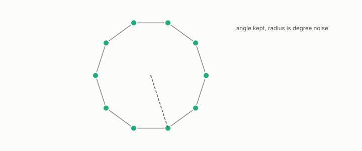

# spectral clustering

**id.** spectral-clustering
**kind.** instrument

## definition

Clustering the rows of the row-normalized spectral embedding, which reads the angle and discards the density. Chapter 3 section 3.3 and chapter 9.

**Example.** Row-normalize the two lowest nontrivial eigenvectors of the Laplacian and run k-means on the angles.

## equation

Book equation 0.19.

    L=I-D^{-1/2}AD^{-1/2},\qquad D=\operatorname{diag}(d_1,\dots,d_n),\qquad L\,u_k=\lambda_k u_k,\ \ 0=\lambda_1\le\lambda_2\le\cdots.

Book equation 3.3.

    X_i=r_i\,\theta_i,\qquad r_i\ \to\ \frac1{\sqrt{d_i}},\qquad \theta_i=\frac{X_i}{\|X_i\|}\in S^{m-1}.

## conditions

- Clustering the rows of the row-normalized spectral embedding, which reads the angle and discards the density. Row normalization puts every row on the unit sphere, keeps the cosine between rows, and ignores a positive rescaling, and the Laplacian's quadratic form is nonnegative, zero on constants, and positive across any edge.
- Ng, Jordan, and Weiss normalized because it improved results, and chapter 3 says why. The Euclidean distance in the embedding converges to degree noise and the angle keeps the geodesics.
- The row normalization applies to eigenvectors of the normalized Laplacian, whose leading vector is proportional to the square root of the degree and not constant.

Conditions are curated in `entries.toml` rather than read from a record.

## ledger

none

## first stated

Ng, Jordan, and Weiss, on spectral clustering, 2002, as chapter 3 section 3.3 and chapter 9 section 9.1 of *Data Mining as Observation* read it, with the angular reading in `the-angular-observer/theorem.md:110-146`.

## measurements

| Where the book states it | Numbers, as the book's sources table records them | Source |
|---|---|---|
| chapter 9 section 9.1 | the geodesic-rank reader discards the radius, row normalization is the angular projection | [`geometric-observation/chapters/ch09_legibility.md:10-41`](https://github.com/ahb-sjsu/geometric-observation/blob/b2626a6/chapters/ch09_legibility.md#L10-L41); `the-angular-observer/theorem.md:110-146` |

## failures and corrections

none

## invariance envelope

none declared

## machine checked

[`lean/DataMiningAsObservation/SpectralEmbedding.lean`](https://github.com/ahb-sjsu/observation-data-mining/blob/f3914f0/lean/DataMiningAsObservation/SpectralEmbedding.lean), theorems `dot_self_nonneg`, `rowNormalize_unit`, `dot_rowNormalize`, `rowNormalize_smul`, at observation-data-mining f3914f0; what the check covers is stated in the book's [appendix C](https://github.com/ahb-sjsu/observation-data-mining/blob/f3914f0/chapters/machine_checked.md).

[`lean/DataMiningAsObservation/Laplacian.lean`](https://github.com/ahb-sjsu/observation-data-mining/blob/f3914f0/lean/DataMiningAsObservation/Laplacian.lean), theorems `quad_eq`, `quad_nonneg`, `quad_const`, `quad_pos_of_edge`, at observation-data-mining f3914f0; what the check covers is stated in the book's [appendix C](https://github.com/ahb-sjsu/observation-data-mining/blob/f3914f0/chapters/machine_checked.md).

## used in

*Data Mining as Observation* chapters 0, 3, 9.

## related

spectral-embedding, laplacian, k-means, recognizer, geodesic-distance

## see also

Book equations stated beside the entry's terms, not defining it: 0.20.

Ledger rows that cite the entry's records without naming it: GO-3, NEG-1.

Sources-table rows that share a record with the entry without naming it: chapter 3 section 3.3, chapter 9 section 9.2.

## status

Generated 2026-09-10 by `encyclopedia/generate.py`; book at observation-data-mining f3914f0; the commit of every record is listed in the encyclopedia's provenance.
