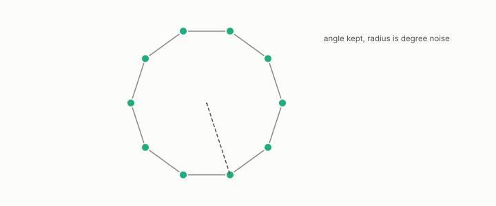

# spectral embedding

**id.** spectral-embedding
**kind.** instrument

## definition

The coordinates a node receives from its values in the first few nontrivial eigenvectors of the graph Laplacian. Clustering those coordinates is spectral clustering. Chapter 3.

**Example.** A ring of ten nodes embeds on a circle, and the angle between two nodes' embeddings tracks their distance along the ring.

## equation

Book equation 0.19.

    L=I-D^{-1/2}AD^{-1/2},\qquad D=\operatorname{diag}(d_1,\dots,d_n),\qquad L\,u_k=\lambda_k u_k,\ \ 0=\lambda_1\le\lambda_2\le\cdots.

Book equation 3.3.

    X_i=r_i\,\theta_i,\qquad r_i\ \to\ \frac1{\sqrt{d_i}},\qquad \theta_i=\frac{X_i}{\|X_i\|}\in S^{m-1}.

## conditions

- The coordinates a node receives from its values in the first few nontrivial eigenvectors of the graph Laplacian. Row normalization puts every embedded row on the unit sphere, leaves the cosine between rows unchanged, and ignores a positive rescaling of a row, so it is the projection onto the read subspace of the geodesic-rank consumer.
- Its magnitude converges to degree noise and its angle keeps the geodesics, so the cosine between embedded rows is the right similarity and the Euclidean distance the wrong one. Clustering the normalized coordinates is spectral clustering, and a density reader of the same embedding reads the complementary coordinate.
- The embedding of equation 0.20 scales each eigenvector entry by the eigenvalue and the degree. Its squared Euclidean distance is the resistance, commute time over volume, exactly for the full spectrum and approximately when only the low modes are kept.

Conditions are curated in `entries.toml` rather than read from a record.

## ledger

none

## first stated

Ng, Jordan, and Weiss, on spectral clustering, 2002, as chapter 3 section 3.3 of *Data Mining as Observation* reads it, with the program's angular reading in `the-angular-observer/theorem.md:110-146`.

## measurements

| Where the book states it | Numbers, as the book's sources table records them | Source |
|---|---|---|
| chapter 3 section 3.3 | row normalization is the projection onto the read subspace of the geodesic-rank consumer | [`geometric-observation/chapters/ch09_legibility.md:31-41`](https://github.com/ahb-sjsu/geometric-observation/blob/0792c84/chapters/ch09_legibility.md#L31-L41); [`geometric-observation/chapters/ch03_historical_precursors.md:98-110`](https://github.com/ahb-sjsu/geometric-observation/blob/0792c84/chapters/ch03_historical_precursors.md#L98-L110) |
| chapter 9 section 9.1 | the geodesic-rank reader discards the radius, row normalization is the angular projection | [`geometric-observation/chapters/ch09_legibility.md:10-41`](https://github.com/ahb-sjsu/geometric-observation/blob/0792c84/chapters/ch09_legibility.md#L10-L41); `the-angular-observer/theorem.md:110-146` |

## failures and corrections

none

## invariance envelope

none declared

## machine checked

[`lean/DataMiningAsObservation/SpectralEmbedding.lean`](https://github.com/ahb-sjsu/observation-data-mining/blob/95af30c/lean/DataMiningAsObservation/SpectralEmbedding.lean), theorems `dot_self_nonneg`, `rowNormalize_unit`, `dot_rowNormalize`, `rowNormalize_smul`, at observation-data-mining 95af30c; what the check covers is stated in the book's [appendix C](https://github.com/ahb-sjsu/observation-data-mining/blob/95af30c/chapters/machine_checked.md).

[`lean/DataMiningAsObservation/Laplacian.lean`](https://github.com/ahb-sjsu/observation-data-mining/blob/95af30c/lean/DataMiningAsObservation/Laplacian.lean), theorems `quad_eq`, `quad_nonneg`, `quad_const`, `quad_pos_of_edge`, at observation-data-mining 95af30c; what the check covers is stated in the book's [appendix C](https://github.com/ahb-sjsu/observation-data-mining/blob/95af30c/chapters/machine_checked.md).

## used in

*Data Mining as Observation* chapters 0, 3, 9.

## related

laplacian, commute-time, geodesic-distance, degree, recognizer

## see also

Book equations stated beside the entry's terms, not defining it: 0.20.

Ledger rows that cite the entry's records without naming it: NEG-1.

Sources-table rows that share a record with the entry without naming it: chapter 3 section 3.3.

## status

Generated 2026-09-08 by `encyclopedia/generate.py`; book at observation-data-mining 95af30c; the commit of every record is listed in the encyclopedia's provenance.
