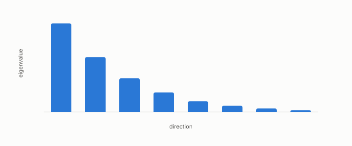

# spectrum

**id.** spectrum
**kind.** concept

## definition

The list of a matrix's eigenvalues. Chapter 0 section 0.4.

**Example.** diag(0.3, 1.7) has spectrum (0.3, 1.7), trace 2.0, and effective rank 1.34.

## equation

Book equation 0.5.

    \Sigma\,v_i=\lambda_i v_i,\qquad \Sigma=\sum_{i=1}^{d}\lambda_i\,v_i v_i^{\top},\qquad v_i\cdot v_j=0\ (i\ne j).

Book equation 0.7.

    r_{\mathrm{eff}}=\frac{\big(\sum_i\lambda_i\big)^{2}}{\sum_i\lambda_i^{2}}.

## conditions

- The list of a matrix's eigenvalues. Its effective rank, the square of its sum over the sum of its squares, lies between one and the dimension, is the dimension for a flat spectrum, and is one for a single eigenvalue.
- The spectrum is not invariant under a change of basis of the input where the trace pairing and the rank are, and the Laplacian's spectrum is what the recognizer reads for dimension and shape.

Conditions are curated in `entries.toml` rather than read from a record.

## ledger

- *measures.* OT-7 `[demonstrated]`. The damage form, trace pairing, rank, and loading covariance are GL(d)-invariant under `P' = A⁻ᵀPA⁻¹`, while spectrum, effective rank, principal angles, and water-filling are O(d)-only — consumer-weighted damage is a geometric scalar, and … [`geometric-observation/claims/LEDGER.md:30`](https://github.com/ahb-sjsu/geometric-observation/blob/fc6b378/claims/LEDGER.md#L30).

## first stated

Chapter 0 section 0.4 of *Data Mining as Observation*, with the program's spectrum records in readscope, `readscope/readscope/spectrum.py:35-70`, and the recognizer battery.

## measurements

none

## failures and corrections

none

## invariance envelope

none declared

## machine checked

[`lean/DataMiningAsObservation/EffectiveRank.lean`](https://github.com/ahb-sjsu/observation-data-mining/blob/c149a10/lean/DataMiningAsObservation/EffectiveRank.lean), theorems `sq_sum_le`, `effRank_le`, `sum_sq_le_sq_sum`, `one_le_effRank`, `effRank_const`, `effRank_single`, at observation-data-mining c149a10; what the check covers is stated in the book's [appendix C](https://github.com/ahb-sjsu/observation-data-mining/blob/c149a10/chapters/machine_checked.md).

## used in

*Data Mining as Observation* chapters 0, 3, 4, 9, 11, 14.

## related

eigenvalue-eigenvector, effective-rank, recognizer, laplacian, isotropic

## see also

Book equations stated beside the entry's terms, not defining it: 9.2.

Ledger rows that cite the entry's records without naming it: GO-3.

Sources-table rows that share a record with the entry without naming it: chapter 4 section 4.2, chapter 9 section 9.4, chapter 14 section 14.3, chapter 14 section 14.5, chapter 14 section 14.7.

## status

Generated 2026-09-09 by `encyclopedia/generate.py`; book at observation-data-mining c149a10; the commit of every record is listed in the encyclopedia's provenance.
