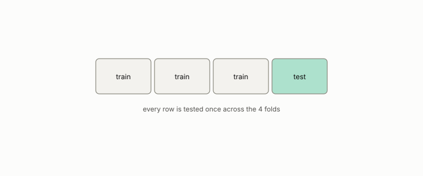

# split

**id.** split
**kind.** instrument

## definition

A partition of the rows into a part the model is fit on and a part it is scored on. A scorer that has read the test part scores it perfectly. Chapter 8 section 8.1.

**Example.** 900 rows for fitting and 100 held out, with the 100 never read until the score.

## equation

Book equation 8.1.

    O_{\mathrm{harness}}=\big(C_{\mathrm{score}},\ G_{\mathrm{metric}},\ B=\text{folds}\times\text{samples}\times\text{seeds}\big).

Book equation 12.3.

    \text{validated}\iff \mathrm{AUROC}_{\text{cross}}-\max\big(\mathrm{AUROC}_{\text{untrained}},\ \mathrm{AUROC}_{\text{BoW}}\big)\ \ge\ 0.10.

## conditions

- A partition of the rows into a part the model is fit on and a part it is scored on. The parts' sizes add to the row count, a row in the test part is not in the training part, and a scorer that has read the test part scores it perfectly, which is leakage.
- The virgin split of the non-oracle test raised the flip's margin to 0.796 against 0.780, and the split is fixed before any transform is fit, since an imputation fit on all rows reads the test part.

Conditions are curated in `entries.toml` rather than read from a record.

## ledger

none

## first stated

Chapter 8 section 8.1 of *Data Mining as Observation*, with the virgin split in `geometric-observation/chapters/ch10_the_blind_probe.md:100-118`.

## measurements

none

## failures and corrections

none

## machine checked

[`lean/DataMiningAsObservation/CrossValidation.lean`](https://github.com/ahb-sjsu/observation-data-mining/blob/95af30c/lean/DataMiningAsObservation/CrossValidation.lean), theorems `sizes_sum`, `accuracy_weighted`, `accuracy_mean_of_equal`, at observation-data-mining 95af30c; what the check covers is stated in the book's [appendix C](https://github.com/ahb-sjsu/observation-data-mining/blob/95af30c/chapters/machine_checked.md).

[`lean/DataMiningAsObservation/Leakage.lean`](https://github.com/ahb-sjsu/observation-data-mining/blob/95af30c/lean/DataMiningAsObservation/Leakage.lean), theorems `errors_lookup_eq_zero`, `lookup_default`, at observation-data-mining 95af30c; what the check covers is stated in the book's [appendix C](https://github.com/ahb-sjsu/observation-data-mining/blob/95af30c/chapters/machine_checked.md).

## used in

*Data Mining as Observation* chapters 0, 1, 2, 3, 4, 5, 6, 7, 8, 9, 10, 11, 12, 13, 14.

## related

cross-validation, leakage, harness, seed, stratification

## see also

Book equations stated beside the entry's terms, not defining it: 8.2.

Ledger rows that cite the entry's records without naming it: NEG-4, GO-B-legal (035→036).

Sources-table rows that share a record with the entry without naming it: chapter 4 section 4.7, chapter 6 section 6.4, chapter 8 section 8.1, chapter 8 section 8.5, chapter 12 section 12.3.

## status

Generated 2026-09-07 by `encyclopedia/generate.py`; book at observation-data-mining 95af30c; the commit of every record is listed in the encyclopedia's provenance.
