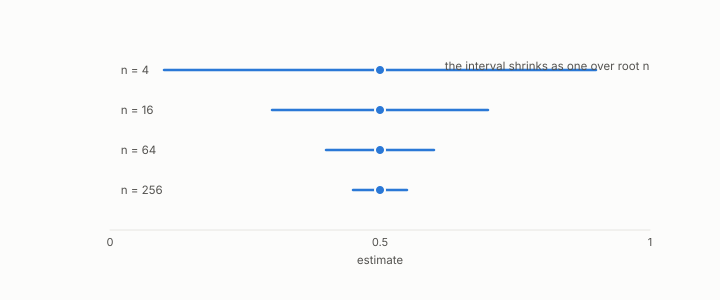

# standard error

**id.** standard-error
**kind.** concept

## definition

The spread of an estimate across repeated samples. Chapter 0 section 0.9.

**Example.** A spread of 0.4 over 16 seeds gives standard error 0.1, and over 64 seeds 0.05.

## equation

Book equation 8.2.

    \begin{gathered} \widehat{\operatorname{Var}}_{\mathrm{NB}}=\Big(\frac1J+\frac{n_{\mathrm{test}}}{n_{\mathrm{train}}}\Big)\hat\sigma^{2}, \\ J=1000,\ \frac{n_{\mathrm{test}}}{n_{\mathrm{train}}}=\frac14\ \Rightarrow\ 1+250=251,\ \ \sqrt{251}=15.84. \end{gathered}

## conditions

- The spread of an estimate across repeated samples, the spread of one draw over the square root of the number of independent draws. It is positive, falls as the draws grow, halves only when the draws quadruple, and tends to zero.
- Dependent draws do not shrink it this way. A thousand repeated folds shrink the naive standard error by a factor near 31.6 and the corrected one by 15.84 less, which is the Nadeau and Bengio correction.

Conditions are curated in `entries.toml` rather than read from a record.

## ledger

none

## first stated

Chapter 0 section 0.9 of *Data Mining as Observation*, with the program's own inflation in `constraint-gap/review/FINDINGS.md:1-35`.

## measurements

| Where the book states it | Numbers, as the book's sources table records them | Source |
|---|---|---|
| chapter 8 section 8.5 | variance inflation 251, SE inflation 15.84, J_eff 3.98, about 62 needed, 3 of 9 at full, 7 at half, 8 at a third | `constraint-gap/review/FINDINGS.md:1-35` |

## failures and corrections

none

## invariance envelope

none declared

## machine checked

[`lean/DataMiningAsObservation/StandardError.lean`](https://github.com/ahb-sjsu/observation-data-mining/blob/f3914f0/lean/DataMiningAsObservation/StandardError.lean), theorems `se_pos`, `se_quarter`, `se_antitone`, `se_tendsto_zero`, `thousand_folds`, at observation-data-mining f3914f0; what the check covers is stated in the book's [appendix C](https://github.com/ahb-sjsu/observation-data-mining/blob/f3914f0/chapters/machine_checked.md).

## used in

*Data Mining as Observation* primer S, chapters 0, 6, 7, 8, 13, 14.

## related

nadeau-and-bengio-correction, harness, multiple-comparisons, preregistration

## see also

Book equations stated beside the entry's terms, not defining it: 0.18.

Sources-table rows that share a record with the entry without naming it: chapter 6 section 6.4.

## status

Generated 2026-09-12 by `encyclopedia/generate.py`; book at observation-data-mining f3914f0; the commit of every record is listed in the encyclopedia's provenance.
