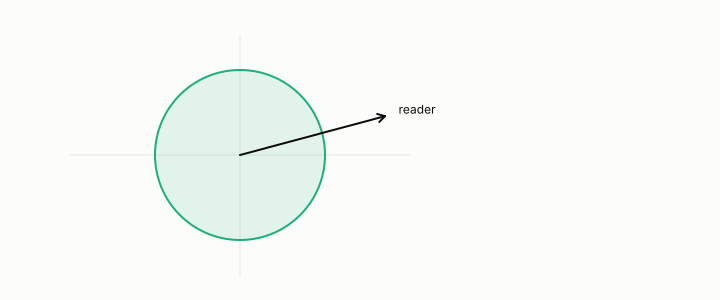

# standardization

**id.** standardization
**kind.** instrument

## definition

Subtracting a column's mean and dividing by its spread, so that it has mean zero and variance one. It is invertible and preserves every ordering, so it changes the reader and not the data. Chapter 2.

## equation

Book equation 2.1.

    P_{C_2\circ C_1}(x)=J_1(x)^{\top}\,P_{C_2}\big(C_1(x)\big)\,J_1(x),\qquad \operatorname{rank}P_{C_2\circ C_1}(x)\le\operatorname{rank}P_{C_2}\big(C_1(x)\big)\quad\text{at each row } x.

Book equation 0.6.

    x_{\mathrm w}=\Sigma^{-1/2}(x-\mu),\qquad \Sigma^{-1/2}=\sum_i\lambda_i^{-1/2}\,v_i v_i^{\top}.

## conditions

- Subtracting a column's mean and dividing by its spread. The standardized column has weighted mean zero and weighted variance one, the transform is invertible, and it preserves every ordering of the rows, so it changes the reader's geometry and not what the table holds.
- An invertible transform identifies no two rows and forms no quotient. For a consumer that reads distances across columns the declaration that scale is irrelevant is almost always right, and for a consumer that reads one column it does nothing.

Conditions are curated in `entries.toml` rather than read from a record.

## ledger

none

## first stated

Chapter 2 section 2.5 of *Data Mining as Observation*, with the whitened code's record in `geometric-observation/chapters/ch08_value.md:84-97`.

## measurements

none

## failures and corrections

none

## machine checked

`lean/DataMiningAsObservation/Standardization.lean`, theorems `mean_zero`, `variance_one`, `standardize_inv`, `standardize_lt_iff`, at observation-data-mining 08b4794.

## used in

*Data Mining as Observation* chapters 0, 1, 2, 3, 4, 6, 9, 10, 11.

## related

whitening, imputation, euclidean-distance, quotient, outlier

## see also

Book equations stated beside the entry's terms, not defining it: 3.1.

Sources-table rows that share a record with the entry without naming it: chapter 2 section 2.1, chapter 2 section 2.5, chapter 4 section 4.3.

## status

Generated 2026-09-06 by `encyclopedia/generate.py`; book at observation-data-mining 08b4794; the commit of every record is listed in the encyclopedia's provenance.
