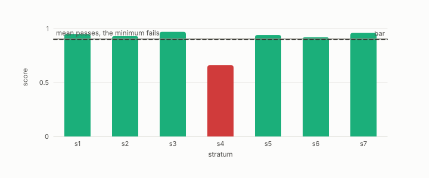

# stratification

**id.** stratification
**kind.** instrument

## definition

Splitting rows into strata, by difficulty or by group, and scoring each separately, so that the report can take the minimum over strata. Chapter 10 and chapter 12.

**Example.** Fourteen strata by difficulty, seven eligible, two abstained for having 2 rows and 1.

## equation

Book equation 10.7.

    \text{verdict}=\min_{i:\ n_i\ge n_{\min},\ |Q_i|\ge q_{\min}}\ \mathrm{score}_i,\qquad \text{ABSTAIN otherwise}.

## conditions

- Splitting rows into strata, by difficulty or by group, and scoring each separately, so that the report can take the minimum over strata and count the strata too thin to score. A weighted aggregate over strata is at most the pass bar when one stratum fails by enough, and the folds of a stratified split test every row once.
- The first strata run scored seven of fourteen eligible strata and abstained on those with two rows and one, and the second prediction inverted, which the record keeps.

Conditions are curated in `entries.toml` rather than read from a record.

## ledger

none

## first stated

Chapter 10 section 10.4 of *Data Mining as Observation*, with the strata design in `turboquant-pro/docs/STRATA_RFC.md:24-98`.

## measurements

| Where the book states it | Numbers, as the book's sources table records them | Source |
|---|---|---|
| chapter 10 section 10.5 | Gate A design error, A prime skew 3.970 to 3.177, max 287 to 213, Robin Hood 0.372 to 0.261, fraction 0.117 to 0.079, compressed path 0.663 vs 0.90, seven strata, 0.62 to 0.69 vs 0.76 to 0.84 | [`turboquant-pro/docs/RESULTS_strata_phase23_gates.md:1-45`](https://github.com/ahb-sjsu/turboquant-pro/blob/856c4cb/docs/RESULTS_strata_phase23_gates.md#L1-L45) |

## failures and corrections

none

## invariance envelope

none declared

## machine checked

[`lean/DataMiningAsObservation/Certificate.lean`](https://github.com/ahb-sjsu/observation-data-mining/blob/6aebdf3/lean/DataMiningAsObservation/Certificate.lean), theorems `falseClear_mul_coverage`, `coverage_empty`, `falseClear_mem_unit`, `minOverStrata_passes_iff`, `minOverStrata_le_weighted_mean`, at observation-data-mining 6aebdf3; what the check covers is stated in the book's [appendix C](https://github.com/ahb-sjsu/observation-data-mining/blob/6aebdf3/chapters/machine_checked.md).

[`lean/DataMiningAsObservation/CrossValidation.lean`](https://github.com/ahb-sjsu/observation-data-mining/blob/6aebdf3/lean/DataMiningAsObservation/CrossValidation.lean), theorems `sizes_sum`, `accuracy_weighted`, `accuracy_mean_of_equal`, at observation-data-mining 6aebdf3; what the check covers is stated in the book's [appendix C](https://github.com/ahb-sjsu/observation-data-mining/blob/6aebdf3/chapters/machine_checked.md).

## used in

*Data Mining as Observation* chapters 0, 5, 8, 10, 11, 12.

## related

min-over-strata, abstention, anti-hub-recall, cross-validation, harness

## see also

Book equations stated beside the entry's terms, not defining it: 14.5, 8.2.

Ledger rows that cite the entry's records without naming it: NEG-14, GO-B-Llama, GO-B-Llama-rematch.

Sources-table rows that share a record with the entry without naming it: chapter 10 section 10.4, chapter 10 section 10.5, chapter 12 section 12.4.

## status

Generated 2026-09-09 by `encyclopedia/generate.py`; book at observation-data-mining 6aebdf3; the commit of every record is listed in the encyclopedia's provenance.
