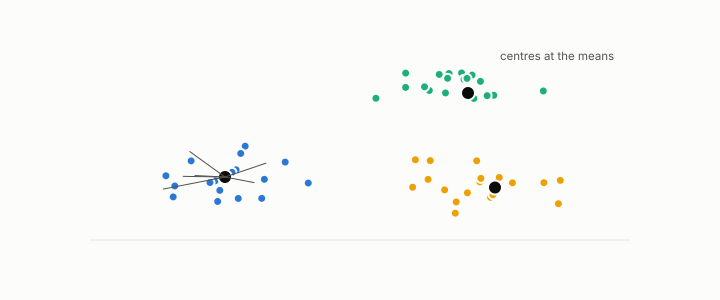

# sum of squared errors

**id.** sum-of-squared-errors
**kind.** concept

## definition

The sum over rows of the squared distance to the row's cluster centre, the validity index k-means minimizes. Chapter 0 section 0.15.

**Example.** Points 1, 2, and 6 with centres 1.5 and 6 have sum of squared errors 0.25 + 0.25 + 0 = 0.5.

## equation

Book equation 9.1.

    \mathrm{SSE}=\sum_{k=1}^{K}\sum_{i\in\mathcal C_k}\|x_i-c_k\|^{2},\qquad\text{the }P_C=I\text{ distortion summed within clusters}.

Book equation 0.30.

    \mathrm{SSE}=\sum_{k}\sum_{i\in\mathcal C_k}\|x_i-c_k\|^{2},\qquad s_i=\frac{b_i-a_i}{\max(a_i,b_i)}.

## conditions

- The sum over rows of the squared distance to the row's cluster centre, the validity index k-means minimizes. The error about any centre is the error about the mean plus the count times the squared distance between the two, so the mean minimizes it, and it is the identity reader's distortion summed within clusters.
- Two clusterings of the same rows with the same sum of squared errors can be read oppositely by a consumer that weighs directions unequally.

Conditions are curated in `entries.toml` rather than read from a record.

## ledger

none

## first stated

Chapter 0 section 0.15 and chapter 9 section 9.1 of *Data Mining as Observation*.

## measurements

none

## failures and corrections

none

## invariance envelope

none declared

## machine checked

[`lean/DataMiningAsObservation/KMeans.lean`](https://github.com/ahb-sjsu/observation-data-mining/blob/6aebdf3/lean/DataMiningAsObservation/KMeans.lean), theorems `sse_decomposition`, `mean_minimizes`, `assign_nearest`, at observation-data-mining 6aebdf3; what the check covers is stated in the book's [appendix C](https://github.com/ahb-sjsu/observation-data-mining/blob/6aebdf3/chapters/machine_checked.md).

[`lean/DataMiningAsObservation/ReconstructionError.lean`](https://github.com/ahb-sjsu/observation-data-mining/blob/6aebdf3/lean/DataMiningAsObservation/ReconstructionError.lean), theorems `recon_nonneg`, `recon_eq_zero_iff`, `recon_sum`, `recon_proj`, at observation-data-mining 6aebdf3; what the check covers is stated in the book's [appendix C](https://github.com/ahb-sjsu/observation-data-mining/blob/6aebdf3/chapters/machine_checked.md).

## used in

*Data Mining as Observation* chapters 0, 9.

## related

k-means, validity-index, reconstruction-error, identity-reader, silhouette

## see also

Book equations stated beside the entry's terms, not defining it: 4.2.

Ledger rows that cite the entry's records without naming it: GO-3.

Sources-table rows that share a record with the entry without naming it: chapter 9 section 9.4, chapter 10 section 10.1.

## status

Generated 2026-09-09 by `encyclopedia/generate.py`; book at observation-data-mining 6aebdf3; the commit of every record is listed in the encyclopedia's provenance.
