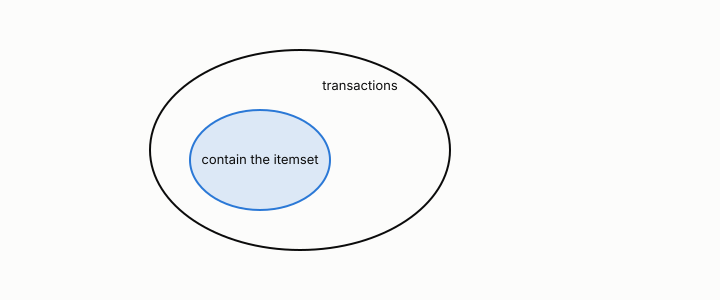

# support

**id.** support
**kind.** concept

## definition

Of an itemset, the fraction of transactions that contain it. Chapter 5.

**Example.** An itemset in 30 of 200 baskets has support 0.15.

## equation

Book equation 5.1.

    s(X)=\frac{\sigma(X)}{N},\qquad c(X\to Y)=\frac{\sigma(X\cup Y)}{\sigma(X)}=\frac{s(X\cup Y)}{s(X)}.

Book equation 5.3.

    X\subseteq Y\ \Longrightarrow\ s(X)\ge s(Y).

## conditions

- The fraction of transactions that contain an itemset. Support cannot increase when an itemset grows, so an infrequent itemset has only infrequent supersets and every subset of a frequent itemset is frequent, which is the license to prune the lattice.
- The count of candidates rather than the count of transactions decides whether a run finishes, and a rare consequent lets lift reach the transaction count on a single co-occurrence.

Conditions are curated in `entries.toml` rather than read from a record.

## ledger

none

## first stated

TSK chapter 5, as chapter 5 section 5.1 of *Data Mining as Observation* states it, with anti-monotonicity as the Apriori license.

## measurements

| Where the book states it | Numbers, as the book's sources table records them | Source |
|---|---|---|
| chapter 5 section 5.1 to 5.3, 5.5 | support, confidence, lift, the Apriori principle, FP-growth, closed and maximal itemsets, objective measures, Simpson's paradox, cross-support | TSK 2e chapter 5 |

## failures and corrections

none

## machine checked

[`lean/DataMiningAsObservation/SafePruning.lean`](https://github.com/ahb-sjsu/observation-data-mining/blob/95af30c/lean/DataMiningAsObservation/SafePruning.lean), theorems `support_anti`, `apriori`, `subset_of_frequent`, at observation-data-mining 95af30c; what the check covers is stated in the book's [appendix C](https://github.com/ahb-sjsu/observation-data-mining/blob/95af30c/chapters/machine_checked.md).

## used in

*Data Mining as Observation* chapters 2, 5, 6, 7, 8.

## related

itemset, apriori, lift, cross-support-ratio

## see also

none

## status

Generated 2026-09-07 by `encyclopedia/generate.py`; book at observation-data-mining 95af30c; the commit of every record is listed in the encyclopedia's provenance.
