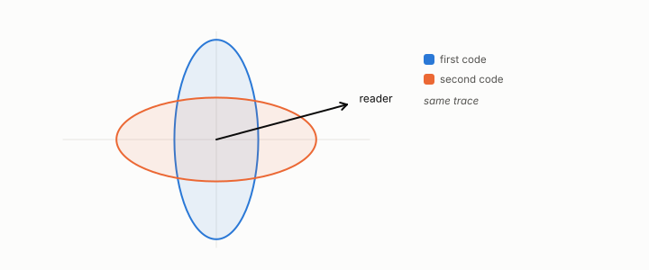

# surrogate

**id.** surrogate
**kind.** instrument

## definition

A quadratic stand-in for the consumer's output metric, the read distortion, used to allocate bits when the output itself cannot be. Chapter 4 section 4.2.

## equation

none

## conditions

- A quadratic stand-in for the consumer's output metric, the read distortion, used to allocate bits when the output itself cannot be. The read distortion is a quadratic form in the read operator, and two readers at different angles rank the same two errors differently.
- At every rate the output coder is at or below the surrogate, which is at or below reconstruction, and the surrogate-to-output gap shrinks from 0.41 to 0.005 as the rate grows, while the read distortion is a control and not a complete rank statistic.

Conditions are curated in `entries.toml` rather than read from a record.

## ledger

- *measures.* GO-6 `[demonstrated]`. At matched rate, output coding ≤ surrogate ≤ reconstruction on the consumer metric; the output–reconstruction gap is governed by the $\ker P_C$ entropy share, and the surrogate–output gap vanishes as rate grows. [`geometric-observation/claims/LEDGER.md:68`](https://github.com/ahb-sjsu/geometric-observation/blob/d1f8988/claims/LEDGER.md#L68).

## first stated

Chapter 4 section 4.2 of *Data Mining as Observation*, with the surrogate ordering in `geometric-observation/claims/LEDGER.md` row GO-6.

## measurements

| Where the book states it | Numbers, as the book's sources table records them | Source |
|---|---|---|
| chapter 4 section 4.2 | water-filling formula, directions below the water get no bits, the surrogate caveat | [`readscope/readscope/allocate.py:1-100`](https://github.com/ahb-sjsu/readscope/blob/c8d0289/readscope/allocate.py#L1-L100) |
| chapter 4 section 4.2 | GO-6, d 8 and r 4, output at or below surrogate at or below reconstruction at every rate, about 500 times, gap 0.41 to 0.005, isotropic control collapses | [`geometric-observation/claims/LEDGER.md`](https://github.com/ahb-sjsu/geometric-observation/blob/d1f8988/claims/LEDGER.md) row GO-6; [`geometric-observation/chapters/ch07_cost.md`](https://github.com/ahb-sjsu/geometric-observation/blob/d1f8988/chapters/ch07_cost.md) |

## failures and corrections

none

## machine checked

`lean/DataMiningAsObservation/ReadDistortion.lean`, theorems `read_distortion`, `identity_reader`, `quad_one`, at observation-data-mining 08b4794.

`lean/DataMiningAsObservation/Isotropy.lean`, theorems `isotropic_reads_same`, `isotropic_no_flip`, `anisotropic_readers_differ`, `flip_iff_anisotropic`, at observation-data-mining 08b4794.

## used in

*Data Mining as Observation* chapters 0, 4, 8.

## related

read-distortion, distortion, output-metric, identity-reader, flip-the

## see also

Book equations stated beside the entry's terms, not defining it: 4.2, 4.6, 0.11.

Ledger rows that cite the entry's records without naming it: NEG-9.

## status

Generated 2026-09-06 by `encyclopedia/generate.py`; book at observation-data-mining 08b4794; the commit of every record is listed in the encyclopedia's provenance.
