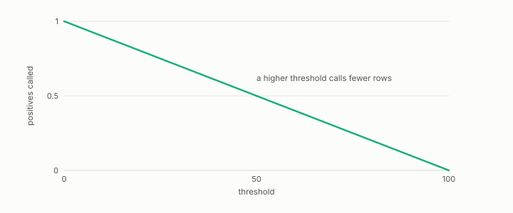

# sweep

**id.** sweep
**kind.** instrument

## definition

Running a measurement across a range of one parameter and reading the curve. Chapter 5 section 5.4 and chapter 9 section 9.3.

**Example.** Thresholds from 0.1 to 0.9 in steps of 0.1 trace nine points of the ROC curve.

## equation

none

## conditions

- Running a measurement across a range of one parameter, a threshold, a budget, or a degradation, and reading the curve. As a threshold rises the set called positive can only shrink, so true and false positives fall together and the ROC curve is traced.
- Fourteen corpora were swept through degradation until retrieval died, the budget sweep found the cliff at k equal to d, and the threshold sweep found the optimal F1 by sort.

Conditions are curated in `entries.toml` rather than read from a record.

## ledger

none

## first stated

Chapter 5 section 5.4 and chapter 9 section 9.3 of *Data Mining as Observation*, with the degradation sweep in `openvector-bench/README.md:60-96`.

## measurements

none

## failures and corrections

none

## machine checked

[`lean/DataMiningAsObservation/Threshold.lean`](https://github.com/ahb-sjsu/observation-data-mining/blob/08b4794/lean/DataMiningAsObservation/Threshold.lean), theorems `predicted_anti`, `tp_anti`, `fp_anti`, `decision_comp`, `predicted_extremes`, at observation-data-mining 08b4794; what the check covers is stated in the book's [appendix C](https://github.com/ahb-sjsu/observation-data-mining/blob/08b4794/chapters/machine_checked.md).

## used in

*Data Mining as Observation* chapters 3, 4, 5, 6, 7, 8, 9, 10, 13.

## related

threshold, roc-curve, budget-cliff, sensitivity, harness

## see also

Book equations stated beside the entry's terms, not defining it: 6.2, 0.28, 9.3.

Ledger rows that cite the entry's records without naming it: GO-3, GO-4.

Sources-table rows that share a record with the entry without naming it: chapter 5 section 5.4, chapter 11 section 11.4, chapter 11 section 11.7, chapter 12 section 12.2.

## status

Generated 2026-09-06 by `encyclopedia/generate.py`; book at observation-data-mining 08b4794; the commit of every record is listed in the encyclopedia's provenance.
