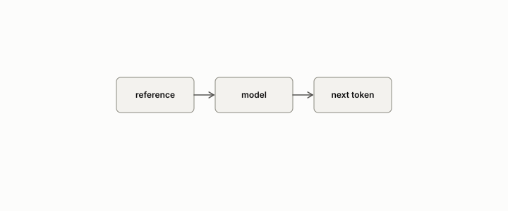

# teacher forcing

**id.** teacher-forcing
**kind.** concept

## definition

Feeding a language model the correct text as context rather than its own earlier outputs. Chapter 0 section 0.11.

**Example.** At step 5 the model is fed the reference's fifth token, not its own fourth guess.

## equation

none

## conditions

- Feeding a model the correct text as context rather than its own earlier outputs. The forced and free runs agree exactly as long as the forced predictions match the reference, and they part at the first token the model gets wrong, after which the free run's context is no longer the reference's.
- Perplexity is measured under teacher forcing, so a good perplexity does not certify a free run. The C-12 record's thirteen-point difference vanished under teacher forcing, and the operator-drift claim it was meant to support is refuted in the ledger.

Conditions are curated in `entries.toml` rather than read from a record.

## ledger

none

## first stated

Chapter 0 section 0.11 of *Data Mining as Observation*, with the program's C-12 record in readscope, `readscope/CALIBRATION.md:600-660`.

## measurements

none

## failures and corrections

none

## invariance envelope

none declared

## machine checked

[`lean/DataMiningAsObservation/TeacherForcing.lean`](https://github.com/ahb-sjsu/observation-data-mining/blob/f3914f0/lean/DataMiningAsObservation/TeacherForcing.lean), theorems `free_eq_take`, `free_length`, `free_ne_of_error`, at observation-data-mining f3914f0; what the check covers is stated in the book's [appendix C](https://github.com/ahb-sjsu/observation-data-mining/blob/f3914f0/chapters/machine_checked.md).

## used in

*Data Mining as Observation* chapters 0, 11.

## related

perplexity, drift, harness, deployment-mismatch

## see also

Book equations stated beside the entry's terms, not defining it: 0.22, 11.1.

Ledger rows that cite the entry's records without naming it: OT-4.

## status

Generated 2026-09-09 by `encyclopedia/generate.py`; book at observation-data-mining f3914f0; the commit of every record is listed in the encyclopedia's provenance.
