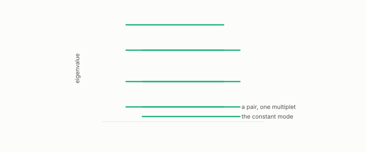

# template match

**id.** template-match
**kind.** instrument

## definition

Comparing a measured list of numbers, such as eigenvalue ratios, to a stored list for each candidate shape and picking the smallest distance between the logarithms. Equation 0.32.

**Example.** The lowest eight eigenvalue ratios matched the sphere template within tolerance, and the torus template did not.

## equation

Book equation 0.32.

    \operatorname{dist}(m,t)=\sqrt{\frac18\sum_{k=1}^{8}\big(\ln m_k-\ln t_k\big)^{2}}.

## conditions

- Comparing a measured list of numbers, the eigenvalue ratios, to a stored list for each candidate shape and picking the smallest root-mean-square distance between the logarithms. The distance is zero between a list and itself, symmetric, and unchanged when both lists are scaled by the same factor, so the match reads shape and not size.
- The templates are frozen before the battery is run, with their code hash recorded, and the match can only name shapes in its template set, which is why the recognizer also certifies that none is present.

Conditions are curated in `entries.toml` rather than read from a record.

## ledger

none

## first stated

Volume 14, chapter 11, `geometric-observation/chapters/ch11_the_recognizer.md:1-95`, DOI 10.5281/zenodo.21776291, and the recognizer battery in the-angular-observer.

## measurements

| Where the book states it | Numbers, as the book's sources table records them | Source |
|---|---|---|
| chapter 9 section 9.2 | the battery, three new templates, frozen ratios, code hash, bars at least 10 of 12 and the dimension ordering, eccentricity scope | `the-angular-observer/PREREG_RECOGNIZER_BATTERY.md:1-80` |

## failures and corrections

none

## machine checked

[`lean/DataMiningAsObservation/Recognizer.lean`](https://github.com/ahb-sjsu/observation-data-mining/blob/95af30c/lean/DataMiningAsObservation/Recognizer.lean), theorems `templateDist_self`, `templateDist_comm`, `templateDist_scale`, `templateDist_nonneg`, at observation-data-mining 95af30c; what the check covers is stated in the book's [appendix C](https://github.com/ahb-sjsu/observation-data-mining/blob/95af30c/chapters/machine_checked.md).

## used in

*Data Mining as Observation* chapters 0, 2, 8, 9, 14.

## related

recognizer, vacuity-threshold, intrinsic-dimension, laplacian

## see also

Book equations stated beside the entry's terms, not defining it: 9.3.

Ledger rows that cite the entry's records without naming it: GO-3.

Sources-table rows that share a record with the entry without naming it: chapter 3 section 3.3, chapter 9 section 9.1, chapter 9 section 9.2, chapter 11 section 11.1.

## status

Generated 2026-09-07 by `encyclopedia/generate.py`; book at observation-data-mining 95af30c; the commit of every record is listed in the encyclopedia's provenance.
