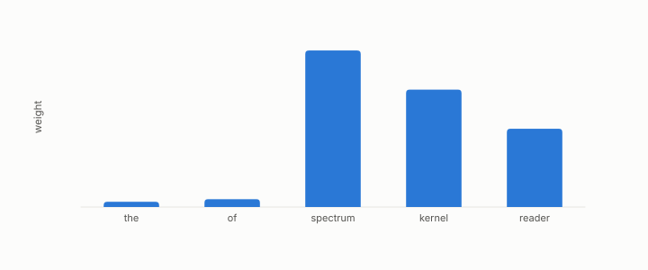

# TF-IDF

**id.** tf-idf
**kind.** concept

## definition

A weighting of term counts by how rare the term is across the collection, so that a term in every document carries no weight. Equation 0.36.

**Example.** A term appearing 5 times in a 100-word document and in 1 of 100 documents weighs 0.05 times the log of 100.

## equation

Book equation 0.36.

    w_{t,d}=\mathrm{tf}_{t,d}\cdot\ln\frac{N}{\mathrm{df}_t},\qquad \mathrm{tf}_{t,d}=\frac{\text{count of }t\text{ in }d}{\text{length of }d},\qquad \mathrm{df}_t=\text{documents containing }t.

Book equation 12.3.

    \text{validated}\iff \mathrm{AUROC}_{\text{cross}}-\max\big(\mathrm{AUROC}_{\text{untrained}},\ \mathrm{AUROC}_{\text{BoW}}\big)\ \ge\ 0.10.

## conditions

- A term's weight is its frequency in the document times the logarithm of the document count over the number containing it. A term in every document carries no weight, the weight is nonnegative and falls as the term spreads, and the frequency lies in the unit interval.
- It is a reader that reads rarity. The legal-citation flip used a frozen TF-IDF to SVD baseline trained on the training split only, and the flip tied while its magnitude overshot, which the ledger carries as partial.

Conditions are curated in `entries.toml` rather than read from a record.

## ledger

none

## first stated

Spärck Jones, a statistical interpretation of term specificity, 1972, as chapter 0 section 0.17 states it, with the program's frozen LSA baseline in ledger row GO-B-legal.

## measurements

none

## failures and corrections

none

## invariance envelope

none declared

## machine checked

[`lean/DataMiningAsObservation/TFIDF.lean`](https://github.com/ahb-sjsu/observation-data-mining/blob/f3914f0/lean/DataMiningAsObservation/TFIDF.lean), theorems `weight_everywhere`, `weight_nonneg`, `weight_antitone`, `tf_mem_unit`, at observation-data-mining f3914f0; what the check covers is stated in the book's [appendix C](https://github.com/ahb-sjsu/observation-data-mining/blob/f3914f0/chapters/machine_checked.md).

## used in

*Data Mining as Observation* chapters 0, 12.

## related

bag-of-words, retrieval-augmented-pipeline, cross-corpus-gate, quotient

## see also

Ledger rows that cite the entry's records without naming it: GO-B-legal (035→036).

## status

Generated 2026-09-09 by `encyclopedia/generate.py`; book at observation-data-mining f3914f0; the commit of every record is listed in the encyclopedia's provenance.
