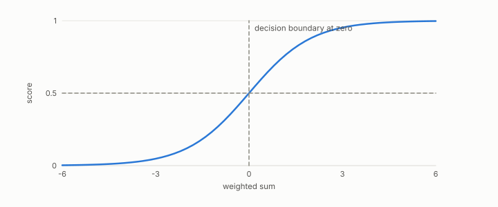

# threshold

**id.** threshold
**kind.** concept

## definition

The value at which a score becomes a positive decision. Chapter 6.

**Example.** Scores 0.3, 0.6, and 0.9 at threshold 0.5 give one negative and two positives; at 0.7, two negatives and one positive.

## equation

Book equation 6.2.

    \begin{gathered} \max_{\tau,\ \mathrm{dir}}F_1\!\Big(\mathbf 1\big[\mathrm{dir}\big(g(f(X)),\tau\big)\big],\,y\Big)=\max_{\tau,\ \mathrm{dir}}F_1\!\Big(\mathbf 1\big[\mathrm{dir}\big(f(X),\tau\big)\big],\,y\Big) \\ \text{for every strictly monotone } g. \end{gathered}

Book equation 0.28.

    P=\frac{TP}{TP+FP},\qquad R=\frac{TP}{TP+FN},\qquad F_1=\frac{2PR}{P+R}.

## conditions

- The value at which a score becomes a positive decision. Raising it can only shrink the predicted set, so true positives and false positives can only fall, which is why the ROC curve is traced by a single sweep, and below every score everything is positive while above every score nothing is.
- A strictly increasing recalibration of the score with the matching recalibration of the threshold leaves every decision unchanged, which is the Monotone Invariance Theorem at the level of one decision.

Conditions are curated in `entries.toml` rather than read from a record.

## ledger

none

## first stated

Chapter 6 section 6.1 of *Data Mining as Observation*, with the program's threshold sweeps in theory-radar.

## measurements

none

## failures and corrections

none

## machine checked

[`lean/DataMiningAsObservation/Threshold.lean`](https://github.com/ahb-sjsu/observation-data-mining/blob/08b4794/lean/DataMiningAsObservation/Threshold.lean), theorems `predicted_anti`, `tp_anti`, `fp_anti`, `decision_comp`, `predicted_extremes`, at observation-data-mining 08b4794; what the check covers is stated in the book's [appendix C](https://github.com/ahb-sjsu/observation-data-mining/blob/08b4794/chapters/machine_checked.md).

## used in

*Data Mining as Observation* chapters 0, 1, 2, 3, 4, 5, 6, 7, 8, 9, 10, 11, 12, 13, 14.

## related

monotone-invariance, youden-f1-bound, reliability-weight, calibration

## see also

none

## status

Generated 2026-09-06 by `encyclopedia/generate.py`; book at observation-data-mining 08b4794; the commit of every record is listed in the encyclopedia's provenance.
