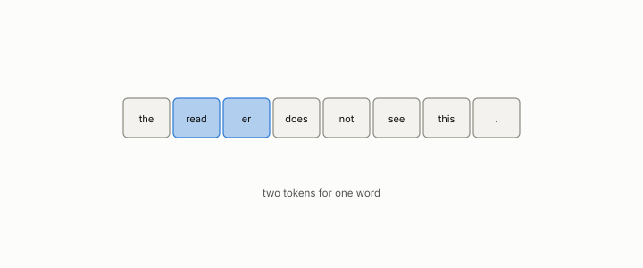

# token

**id.** token
**kind.** concept

## definition

A piece of text, roughly a word, the unit a language model reads and writes. Chapter 0 section 0.11.

## equation

Book equation 0.22.

    \mathrm{PPL}=2^{H},\qquad H=-\frac1T\sum_{t=1}^{T}\log_2 p\big(w_t\mid w_{<t}\big).

Book equation 0.23.

    \operatorname{softmax}(z)_i=\frac{e^{z_i}}{\sum_j e^{z_j}},\qquad \text{output}=\sum_i\operatorname{softmax}\!\Big(\frac{q\cdot k_i}{\sqrt{d}}\Big)_{\!i}\,v_i.

## conditions

- A piece of text, roughly a word, the unit a language model reads and writes. A model reads a sequence of tokens and outputs a probability for the next one, and perplexity is two to the power of the average bits per token, so it is at least one and equals the vocabulary size for a uniform guess.
- The key-value cache stores one key and one value per token per head, and a generation of 512 tokens under a wrong codebook was where the retracted degradation curve was measured. Token counts are the budget in every serving row of chapter 13.

Conditions are curated in `entries.toml` rather than read from a record.

## ledger

none

## first stated

Chapter 0 section 0.11 of *Data Mining as Observation*, with the program's serving measurements in `geometric-observation/experiments/GO-kv-serving-flip-NOTES.md`.

## measurements

none

## failures and corrections

none

## machine checked

`lean/DataMiningAsObservation/Perplexity.lean`, theorems `bits_nonneg`, `one_le_perplexity`, `perplexity_uniform`, `perplexity_mono`, `bits_of_finding`, at observation-data-mining 08b4794.

## used in

*Data Mining as Observation* chapters 0, 4, 8, 11, 12, 13.

## related

perplexity, attention, kv-cache, rotary-position-embedding, teacher-forcing

## see also

Book equations stated beside the entry's terms, not defining it: 11.1.

Sources-table rows that share a record with the entry without naming it: chapter 13 section 13.6.

## status

Generated 2026-09-06 by `encyclopedia/generate.py`; book at observation-data-mining 08b4794; the commit of every record is listed in the encyclopedia's provenance.
