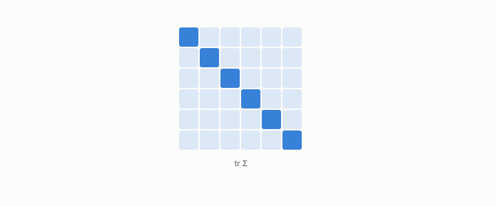

# trace

**id.** trace
**kind.** concept

## definition

The sum of a matrix's diagonal, which for a covariance is the total variance. Equation 0.3.

**Example.** diag(0.3, 1.7) has trace 2.0, the total variance.

## equation

Book equation 0.3.

    \Sigma_{ij}=\mathbb E\big[(x_i-\mu_i)(x_j-\mu_j)\big],\qquad \operatorname{tr}\Sigma=\sum_{i}\Sigma_{ii}.

Book equation 0.10.

    d_O=\operatorname{tr}(P_C\,M_\delta)=\mathbb E\!\left[\delta^{\top}P_C\,\delta\right],\qquad M_\delta=\mathbb E\!\left[\delta\delta^{\top}\right],\qquad P_C=I\ \Rightarrow\ d_O=\operatorname{tr}M_\delta.

## conditions

- The sum of a matrix's diagonal. It is linear, the trace of the identity is the dimension, the trace of an outer product is the vector's squared length, the trace of a product does not depend on the order, and the trace of a read operator times a rank-one error is the read distortion of that error.
- For a covariance the trace is the total variance, and the trace pairing of a read operator with a second moment is the invariant the ledger's row OT-7 names, unchanged by a change of basis where the spectrum and effective rank are not.

Conditions are curated in `entries.toml` rather than read from a record.

## ledger

- *measures.* OT-7 `[demonstrated]`. The damage form, trace pairing, rank, and loading covariance are GL(d)-invariant under `P' = A⁻ᵀPA⁻¹`, while spectrum, effective rank, principal angles, and water-filling are O(d)-only — consumer-weighted damage is a geometric scalar, and … [`geometric-observation/claims/LEDGER.md:30`](https://github.com/ahb-sjsu/geometric-observation/blob/0792c84/claims/LEDGER.md#L30).

## first stated

Chapter 0 section 0.2 of *Data Mining as Observation*, with the trace pairing of Volume 14's invariance row OT-7.

## measurements

none

## failures and corrections

none

## machine checked

[`lean/DataMiningAsObservation/Trace.lean`](https://github.com/ahb-sjsu/observation-data-mining/blob/95af30c/lean/DataMiningAsObservation/Trace.lean), theorems `trace_add`, `trace_smul`, `trace_one`, `trace_vecMulVec`, `trace_mul_comm`, `trace_read`, `trace_identity_read`, at observation-data-mining 95af30c; what the check covers is stated in the book's [appendix C](https://github.com/ahb-sjsu/observation-data-mining/blob/95af30c/chapters/machine_checked.md).

## used in

*Data Mining as Observation* chapters 0, 1, 3, 4, 13.

## related

covariance-matrix, read-distortion, identity-reader, effective-rank

## see also

Ledger rows that cite the entry's records without naming it: OT-2.

Sources-table rows that share a record with the entry without naming it: chapter 2 section 2.2.

## status

Generated 2026-09-07 by `encyclopedia/generate.py`; book at observation-data-mining 95af30c; the commit of every record is listed in the encyclopedia's provenance.
