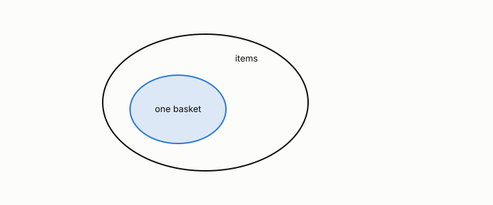

# transaction

**id.** transaction
**kind.** concept

## definition

One row of a market-basket table, the set of items bought together. Chapter 5 section 5.1.

**Example.** Bread, butter, and jam bought together is one transaction, one basket.

## equation

Book equation 5.1.

    s(X)=\frac{\sigma(X)}{N},\qquad c(X\to Y)=\frac{\sigma(X\cup Y)}{\sigma(X)}=\frac{s(X\cup Y)}{s(X)}.

Book equation 5.3.

    X\subseteq Y\ \Longrightarrow\ s(X)\ge s(Y).

## conditions

- One row of a market-basket table, the set of items bought together. The support of an itemset counts the transactions that contain it, it cannot rise as the itemset grows, and the support fraction lies in the unit interval.
- A transaction is the unit the consumer reads in chapter 5, and which items count as the same is the quotient the pattern report has to name.

Conditions are curated in `entries.toml` rather than read from a record.

## ledger

none

## first stated

Agrawal, Imieliński, and Swami, mining association rules, 1993, as chapter 5 section 5.1 of *Data Mining as Observation* reads it.

## measurements

none

## failures and corrections

none

## invariance envelope

none declared

## machine checked

[`lean/DataMiningAsObservation/ItemSet.lean`](https://github.com/ahb-sjsu/observation-data-mining/blob/6aebdf3/lean/DataMiningAsObservation/ItemSet.lean), theorems `supportFrac_mem_unit`, `supportFrac_empty`, `supportFrac_anti`, `supportFrac_union_le`, `closed_of_maximal`, at observation-data-mining 6aebdf3; what the check covers is stated in the book's [appendix C](https://github.com/ahb-sjsu/observation-data-mining/blob/6aebdf3/chapters/machine_checked.md).

[`lean/DataMiningAsObservation/SafePruning.lean`](https://github.com/ahb-sjsu/observation-data-mining/blob/6aebdf3/lean/DataMiningAsObservation/SafePruning.lean), theorems `support_anti`, `apriori`, `subset_of_frequent`, at observation-data-mining 6aebdf3; what the check covers is stated in the book's [appendix C](https://github.com/ahb-sjsu/observation-data-mining/blob/6aebdf3/chapters/machine_checked.md).

## used in

*Data Mining as Observation* chapters 1, 5, 13.

## related

itemset, support, confidence, apriori-principle, anti-monotonicity

## see also

Sources-table rows that share a record with the entry without naming it: chapter 5 section 5.1 to 5.3, 5.5.

## status

Generated 2026-09-09 by `encyclopedia/generate.py`; book at observation-data-mining 6aebdf3; the commit of every record is listed in the encyclopedia's provenance.
