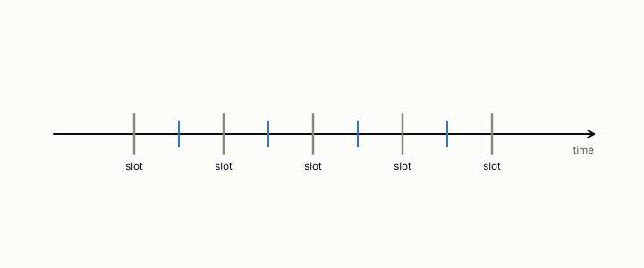

# transmission time interval

**id.** transmission-time-interval
**kind.** concept

## definition

The one-millisecond slot in which a 5G tower schedules a transmission, abbreviated TTI. Chapter 13.

**Example.** A coherence time of 20 milliseconds spans 20 slots.

## equation

Book equation 13.2.

    \begin{gathered} T_{\mathrm{coh}}=\frac{0.423}{f_D}, \\ \text{refuted fit:}\ \ \phi\approx0.177\,T_{\mathrm{coh}}\ (R^{2}=0.915), \qquad \text{sealed:}\ \ \phi\le 6\ \text{TTI at }10\ \text{Hz},\ \ 1\ \text{TTI at}\ \ge50\ \text{Hz}. \end{gathered}

## conditions

- The one-millisecond slot in which a 5G tower schedules a transmission, abbreviated TTI. A duration of m milliseconds spans m slots, slots add over consecutive durations, and a longer duration spans more of them, which is the arithmetic the refresh floors are counted in.
- The sealed floors were 4, 1, and 1 slots at Doppler frequencies of 10, 50, and 400 hertz, and the earlier fit of the floor as a fixed fraction of the coherence time was refuted and is not to be cited.

Conditions are curated in `entries.toml` rather than read from a record.

## ledger

none

## first stated

Chapter 0 section 0.13 of *Data Mining as Observation*, with the program's sealed floors in `observation-theory-campaigns/experiments/RADIO-FRESHNESS-TRACK.md:20-35`.

## measurements

none

## failures and corrections

none

## invariance envelope

none declared

## machine checked

[`lean/DataMiningAsObservation/TTI.lean`](https://github.com/ahb-sjsu/observation-data-mining/blob/95af30c/lean/DataMiningAsObservation/TTI.lean), theorems `slots_of_ms`, `slots_add`, `slots_mono`, `slots_coherence`, at observation-data-mining 95af30c; what the check covers is stated in the book's [appendix C](https://github.com/ahb-sjsu/observation-data-mining/blob/95af30c/chapters/machine_checked.md).

## used in

*Data Mining as Observation* chapters 13.

## related

block-error-rate, coherence-time, refresh-floor, freshness

## see also

Book equations stated beside the entry's terms, not defining it: 0.25.

Sources-table rows that share a record with the entry without naming it: chapter 13 section 13.3, chapter 13 section 13.4.

## status

Generated 2026-09-08 by `encyclopedia/generate.py`; book at observation-data-mining 95af30c; the commit of every record is listed in the encyclopedia's provenance.
