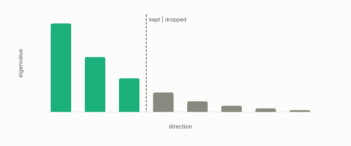

# truncation

**id.** truncation
**kind.** instrument

## definition

Keeping the first k components of a spectrum and dropping the rest, a bet that the consumer reads the top of the spectrum. Chapter 4 section 4.5.

**Example.** Keeping 64 of 300 GloVe components kept 73 percent of the variance and lost 0.685 against 0.862 downstream.

## equation

none

## conditions

- Keeping the first k components of a spectrum and dropping the rest. The variance kept grows with k and reaches one at full rank, and the error is the sum of the dropped eigenvalues, so truncation is a bet that the consumer reads the top of the spectrum.
- Truncation to 64 components kept 73 percent of GloVe's variance and lost 0.685 against 0.862 downstream, is reproducible, and loses on compact sets.

Conditions are curated in `entries.toml` rather than read from a record.

## ledger

none

## first stated

Chapter 4 section 4.5 of *Data Mining as Observation*, with the truncation claim in `turboquant-pro/CLAIMS.md:28-49` and the GloVe table in `turboquant-pro/benchmarks/RESULTS_glove.md:1-40`.

## measurements

| Where the book states it | Numbers, as the book's sources table records them | Source |
|---|---|---|
| chapter 4 section 4.5 | truncation claim reproducible, loses on compact sets | [`turboquant-pro/CLAIMS.md:28-49`](https://github.com/ahb-sjsu/turboquant-pro/blob/856c4cb/CLAIMS.md#L28-L49) |
| chapter 11 section 11.5 | 9.6x at recall 0.999 CI-gated on GloVe 1.18M; 32x at 0.9993 on private 199k LaBSE, ties OPQ, beats RaBitQ, 20x build; 27.7x and 114x reported; PCA truncation loses on compact sets; 20x at 199k and 4x at 1M over OPQ; RaBitQ builds in under a second | [`turboquant-pro/CLAIMS.md:28-49`](https://github.com/ahb-sjsu/turboquant-pro/blob/856c4cb/CLAIMS.md#L28-L49) |

## failures and corrections

none

## invariance envelope

none declared

## machine checked

[`lean/DataMiningAsObservation/PCA.lean`](https://github.com/ahb-sjsu/observation-data-mining/blob/f3914f0/lean/DataMiningAsObservation/PCA.lean), theorems `varAlong_basis`, `varAlong_le`, `varAlong_ge`, `dropped_eq`, `dropped_nonneg`, at observation-data-mining f3914f0; what the check covers is stated in the book's [appendix C](https://github.com/ahb-sjsu/observation-data-mining/blob/f3914f0/chapters/machine_checked.md).

[`lean/DataMiningAsObservation/ExplainedVariance.lean`](https://github.com/ahb-sjsu/observation-data-mining/blob/f3914f0/lean/DataMiningAsObservation/ExplainedVariance.lean), theorems `explained_mem_unit`, `explained_mono`, `explained_full`, `retained_identity`, `retained_example`, at observation-data-mining f3914f0; what the check covers is stated in the book's [appendix C](https://github.com/ahb-sjsu/observation-data-mining/blob/f3914f0/chapters/machine_checked.md).

## used in

*Data Mining as Observation* primer L, chapters 4, 11.

## related

principal-component-analysis, explained-variance, budget, spectrum, concentrated

## see also

Book equations stated beside the entry's terms, not defining it: 4.2, 0.7, 11.4.

Ledger rows that cite the entry's records without naming it: GO-4.

Sources-table rows that share a record with the entry without naming it: chapter 4 section 4.5.

## status

Generated 2026-09-09 by `encyclopedia/generate.py`; book at observation-data-mining f3914f0; the commit of every record is listed in the encyclopedia's provenance.
