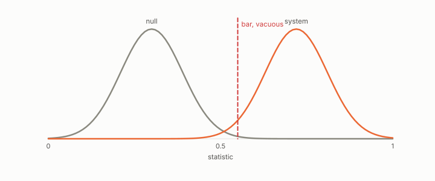

# vacuity threshold

**id.** vacuity-threshold
**kind.** result

## definition

The value of a certificate's statistic below which the certificate is uninformative, derived from the problem rather than tuned to the data. Chapter 9.

**Example.** A certificate statistic at the maximum certifiable value, 1.83, is vacuous, and the derived threshold says so before the data is read.

## equation

Book equation 9.3.

    \hat\mu=\frac{\bar s_{\mathrm{true}}-\bar s_{\mathrm{distr}}}{\sigma_{\mathrm{distr}}},\qquad \mu_{\mathrm{crit}}=\mathbb E\Big[\max_{N-1}\mathcal N(0,1)\Big],\qquad \rho=\frac{\hat\mu}{\mu_{\mathrm{crit}}},\qquad \rho=1\ \text{vacuous}.

## conditions

- The threshold is derived from the problem, the expected maximum of the distractors' margins, and is not tuned to the data.
- A certificate at or below the threshold proves nothing about the object. It has not shown that no structure exists, only that this test could not certify one at this resolution.
- Tested under seal on retrieval, which is recognition with one candidate per query, and the transition has a finite width.

Conditions are curated in `entries.toml` rather than read from a record.

## ledger

- *measures.* GO-3 `[demonstrated]`. The certificate's vacuity threshold predicts where single-stage retrieval dies. [`geometric-observation/claims/LEDGER.md:65`](https://github.com/ahb-sjsu/geometric-observation/blob/ab4a0db/claims/LEDGER.md#L65).

## first stated

Volume 14, the GO-3 registration and its notes, `geometric-observation/experiments/GO3-certificate-vacuity-v3-NOTES.md:1-60`, DOI 10.5281/zenodo.21776291, and chapter 9 section 9.3 of *Data Mining as Observation*.

## measurements

| Where the book states it | Numbers, as the book's sources table records them | Source |
|---|---|---|
| chapter 9 section 9.3 | the margin certificate, mu crit as the expected maximum of N minus 1 standard normals, rho, death at 0.948 within 6 percent, Spearman 0.991 vs 0.873, fourteen corpora, six gates, the v1 to v3 path, the standing correction | [`geometric-observation/experiments/GO3-certificate-vacuity-v3-NOTES.md:1-60`](https://github.com/ahb-sjsu/geometric-observation/blob/ab4a0db/experiments/GO3-certificate-vacuity-v3-NOTES.md#L1-L60); [`geometric-observation/claims/LEDGER.md`](https://github.com/ahb-sjsu/geometric-observation/blob/ab4a0db/claims/LEDGER.md) row GO-3 |

## failures and corrections

none

## invariance envelope

none declared

## machine checked

[`lean/DataMiningAsObservation/Vacuity.lean`](https://github.com/ahb-sjsu/observation-data-mining/blob/95af30c/lean/DataMiningAsObservation/Vacuity.lean), theorems `maxOver_mono`, `rho_eq_one_iff`, `rho_lt_one_of_lt`, at observation-data-mining 95af30c; what the check covers is stated in the book's [appendix C](https://github.com/ahb-sjsu/observation-data-mining/blob/95af30c/chapters/machine_checked.md).

## used in

*Data Mining as Observation* chapters 8, 9.

## related

certificate, rank-certificate, recognizer

## see also

none

## status

Generated 2026-09-09 by `encyclopedia/generate.py`; book at observation-data-mining 95af30c; the commit of every record is listed in the encyclopedia's provenance.
