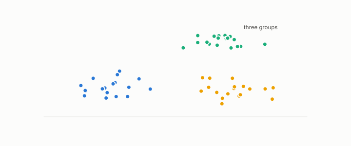

# validity index

**id.** validity-index
**kind.** concept

## definition

A score for a clustering computed without labels. Chapter 9.

**Example.** The silhouette of a clustering with two well separated groups is near 0.8, and near 0 the clustering says nothing.

## equation

Book equation 9.1.

    \mathrm{SSE}=\sum_{k=1}^{K}\sum_{i\in\mathcal C_k}\|x_i-c_k\|^{2},\qquad\text{the }P_C=I\text{ distortion summed within clusters}.

Book equation 0.30.

    \mathrm{SSE}=\sum_{k}\sum_{i\in\mathcal C_k}\|x_i-c_k\|^{2},\qquad s_i=\frac{b_i-a_i}{\max(a_i,b_i)}.

## conditions

- A score for a clustering computed without labels. The silhouette is the case, in the interval from minus one to one, positive exactly when a row is closer to its own cluster, and unchanged by a common rescaling of the distances.
- A validity index is an output metric and needs a null, since it is computed under the identity reader on the distances it is given, which is why chapter 9 asks the recognizer to name the manifold or certify that none is present.

Conditions are curated in `entries.toml` rather than read from a record.

## ledger

none

## first stated

TSK chapter 7 on cluster validity, as chapter 9 section 9.1 of *Data Mining as Observation* reads it, an output metric that needs a null.

## measurements

none

## failures and corrections

none

## invariance envelope

none declared

## machine checked

[`lean/DataMiningAsObservation/Silhouette.lean`](https://github.com/ahb-sjsu/observation-data-mining/blob/f3914f0/lean/DataMiningAsObservation/Silhouette.lean), theorems `silhouette_mem`, `silhouette_pos_iff`, `silhouette_scale`, `silhouette_self`, at observation-data-mining f3914f0; what the check covers is stated in the book's [appendix C](https://github.com/ahb-sjsu/observation-data-mining/blob/f3914f0/chapters/machine_checked.md).

## used in

*Data Mining as Observation* primer S, chapters 0, 1, 2, 3, 4, 6, 7, 8, 9, 10, 11, 12, 13, 14.

## related

silhouette, recognizer, vacuity-threshold, null-model

## see also

Ledger rows that cite the entry's records without naming it: GO-3.

## status

Generated 2026-09-09 by `encyclopedia/generate.py`; book at observation-data-mining f3914f0; the commit of every record is listed in the encyclopedia's provenance.
