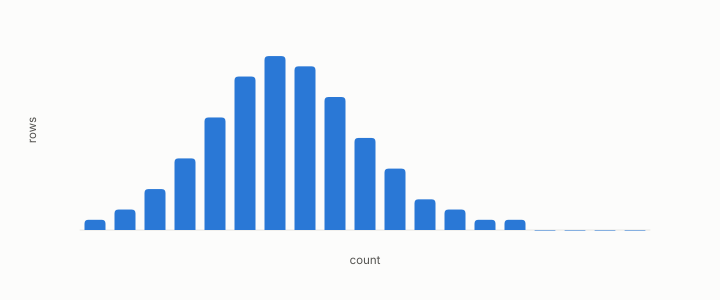

# variance

**id.** variance
**kind.** concept

## definition

The mean squared deviation of a column from its mean, the identity reader's measure of spread. Chapter 0 section 0.3.

**Example.** Values 2, 4, and 6 have mean 4 and variance (4 + 0 + 4) over 3, or 2.667.

## equation

Book equation 9.1.

    \mathrm{SSE}=\sum_{k=1}^{K}\sum_{i\in\mathcal C_k}\|x_i-c_k\|^{2},\qquad\text{the }P_C=I\text{ distortion summed within clusters}.

## conditions

- The weighted mean of the squared deviation of a column from its weighted mean. It is nonnegative, equals the mean square less the squared mean, is zero for a constant column, scales with the square of a rescaling, and with positive weights is zero only for a constant column.
- Variance is the identity reader's measure of spread. A direction with large variance and no group structure pulls principal components and k-means centres alike, and whether a consumer reads that direction is a separate question.

Conditions are curated in `entries.toml` rather than read from a record.

## ledger

none

## first stated

Chapter 0 section 0.3 of *Data Mining as Observation*, with the program's spectrum tools in `readscope/readscope/spectrum.py:35-70`.

## measurements

none

## failures and corrections

none

## invariance envelope

none declared

## machine checked

[`lean/DataMiningAsObservation/Variance.lean`](https://github.com/ahb-sjsu/observation-data-mining/blob/f3914f0/lean/DataMiningAsObservation/Variance.lean), theorems `variance_nonneg`, `variance_eq`, `variance_const`, `variance_smul`, `eq_mean_of_variance_eq_zero`, at observation-data-mining f3914f0; what the check covers is stated in the book's [appendix C](https://github.com/ahb-sjsu/observation-data-mining/blob/f3914f0/chapters/machine_checked.md).

## used in

*Data Mining as Observation* primers L and S, chapters 0, 1, 2, 3, 4, 6, 7, 8, 9, 10, 12, 14.

## related

covariance-matrix, explained-variance, standardization, spectrum, effective-rank

## see also

Book equations stated beside the entry's terms, not defining it: 0.5, 0.7.

Ledger rows that cite the entry's records without naming it: OT-7.

Sources-table rows that share a record with the entry without naming it: chapter 4 section 4.2, chapter 9 section 9.4.

## status

Generated 2026-09-09 by `encyclopedia/generate.py`; book at observation-data-mining f3914f0; the commit of every record is listed in the encyclopedia's provenance.
