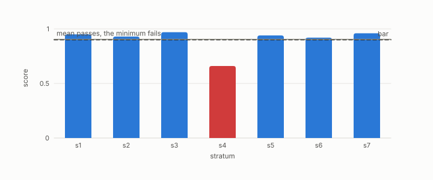

# verdict

**id.** verdict
**kind.** concept

## definition

The outcome of a registered test, pass, fail, or abstain, taken as the worst group with the groups too thin to score counted. Chapter 1 section 1.5 and chapter 10 section 10.4.

**Example.** Strata at 0.95, 0.93, 0.97, and 0.66 against a bar of 0.90 give the verdict fail, with the failing stratum named.

## equation

Book equation 10.7.

    \text{verdict}=\min_{i:\ n_i\ge n_{\min},\ |Q_i|\ge q_{\min}}\ \mathrm{score}_i,\qquad \text{ABSTAIN otherwise}.

Book equation 14.5.

    \mathrm{FC}_g=\Pr\big[y=\text{violation}\ \big|\ \hat y=\text{clear},\ g\big],\qquad \text{verdict}=\max_{g:\ n_g\ge n_{\min}}\mathrm{FC}_g,\qquad \text{ABSTAIN otherwise}.

## conditions

- The outcome of a registered test, pass, fail, or abstain, taken as the worst group with the groups too thin to score counted. A verdict at one bar implies the verdict at every lower bar, and an abstention is reported as a verdict and not dropped.
- A verdict is relative to a budget and does not transfer to another, and the same two codes get opposite verdicts from two output metrics, so a verdict names its bar, its null, its budget, and its consumer.

Conditions are curated in `entries.toml` rather than read from a record.

## ledger

none

## first stated

Chapter 1 section 1.5 and chapter 10 section 10.4 of *Data Mining as Observation*, with the six classes in `geometric-observation/PROTOCOL.md:58-75`.

## measurements

| Where the book states it | Numbers, as the book's sources table records them | Source |
|---|---|---|
| chapter 9 section 9.2 | 12 of 12, dimensions 1.81, 2.80, 1.74, angular Spearman ranges, eccentricity spreads, verdict confirmed, GO-P-2026-041 | `the-angular-observer/experiments/manifold-recovery/battery_result.json` |

## failures and corrections

none

## invariance envelope

none declared

## machine checked

[`lean/DataMiningAsObservation/Bar.lean`](https://github.com/ahb-sjsu/observation-data-mining/blob/f3914f0/lean/DataMiningAsObservation/Bar.lean), theorems `passes_anti`, `passes_mono`, `discriminates_iff`, `no_bar_of_null_ge`, `exists_bar_of_lt`, `vacuous_of_null_passes`, at observation-data-mining f3914f0; what the check covers is stated in the book's [appendix C](https://github.com/ahb-sjsu/observation-data-mining/blob/f3914f0/chapters/machine_checked.md).

[`lean/DataMiningAsObservation/Abstention.lean`](https://github.com/ahb-sjsu/observation-data-mining/blob/f3914f0/lean/DataMiningAsObservation/Abstention.lean), theorems `abstain_not_passes`, `verdict_eq_none_iff`, `passes_verdict_iff`, `inf_le_of_subset`, at observation-data-mining f3914f0; what the check covers is stated in the book's [appendix C](https://github.com/ahb-sjsu/observation-data-mining/blob/f3914f0/chapters/machine_checked.md).

## used in

*Data Mining as Observation* chapters 0, 1, 2, 3, 4, 6, 7, 8, 9, 10, 11, 12, 13, 14.

## related

bar, abstention, ledger-class, min-over-strata, certificate

## see also

Book equations stated beside the entry's terms, not defining it: 8.3.

Ledger rows that cite the entry's records without naming it: GO-3, NEG-14.

Sources-table rows that share a record with the entry without naming it: chapter 1 section 1.5, chapter 3 section 3.5, chapter 8 section 8.10, chapter 10 section 10.2, chapter 11 section 11.6.

## status

Generated 2026-09-09 by `encyclopedia/generate.py`; book at observation-data-mining f3914f0; the commit of every record is listed in the encyclopedia's provenance.
