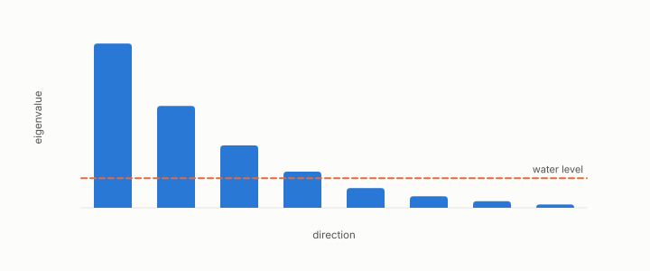

# water-filling

**id.** water-filling
**kind.** concept

## definition

The allocation of a bit budget across directions that gives each direction half the log of its sensitivity-weighted variance over a common water level, and nothing to directions under the water. Equation 0.13.

**Example.** Directions with variances 4, 1, and 0.1 and a water level of 0.5 get bits in proportion to the log of 8, the log of 2, and nothing.

**Known as, or related to prior art.** Reverse water-filling of rate-distortion theory, per Cover and Thomas, applied to the read-weighted spectrum.

## equation

none

## conditions

- The closed form assumes a uniform quantizer at high rate, so that each bit quarters the squared error, and directions taken as the eigenvectors of the covariance so that their errors add.
- The sensitivity of each direction is read in that same eigenbasis, as the quadratic form of the read operator along the eigenvector, and pairing the eigenvalues of the two matrices is valid only when they share an eigenbasis.
- Coarse quantizers, unequal codebook steps, and errors not spread evenly depart from the formula, and chapter 4 reports where a measured allocation did.

Conditions are curated in `entries.toml` rather than read from a record.

## ledger

none

## first stated

Shannon's power allocation across channels, applied with a consumer's sensitivity in place of a signal's power in readscope and turboquant-pro, and chapter 0 section 0.7 and chapter 4 section 4.2 of *Data Mining as Observation*.

## measurements

| Where the book states it | Numbers, as the book's sources table records them | Source |
|---|---|---|
| chapter 4 section 4.2 | water-filling formula, directions below the water get no bits, the surrogate caveat | [`readscope/readscope/allocate.py:1-100`](https://github.com/ahb-sjsu/readscope/blob/856e678/readscope/allocate.py#L1-L100) |

## failures and corrections

none

## invariance envelope

none declared

## machine checked

[`lean/DataMiningAsObservation/WaterFilling.lean`](https://github.com/ahb-sjsu/observation-data-mining/blob/6aebdf3/lean/DataMiningAsObservation/WaterFilling.lean), theorems `contribution_eq_water`, `terms_mul`, `two_sqrt_le`, `distortion2_ge`, `distortion2_eq_of_equal`, at observation-data-mining 6aebdf3; what the check covers is stated in the book's [appendix C](https://github.com/ahb-sjsu/observation-data-mining/blob/6aebdf3/chapters/machine_checked.md).

## used in

*Data Mining as Observation* chapters 0, 4.

## related

read-operator, read-distortion, alignment, flip

## see also

Book equations stated beside the entry's terms, not defining it: 0.13, 4.2.

Sources-table rows that share a record with the entry without naming it: chapter 2 section 2.3, chapter 2 section 2.4, chapter 2 section 2.6, chapter 3 section 3.4, chapter 4 section 4.2, chapter 4 section 4.4, chapter 4 section 4.5, chapter 6 section 6.1, chapter 8 section 8.3, chapter 8 section 8.4, chapter 11 section 11.7, chapter 11 section 11.9.

## status

Generated 2026-09-09 by `encyclopedia/generate.py`; book at observation-data-mining 6aebdf3; the commit of every record is listed in the encyclopedia's provenance.
