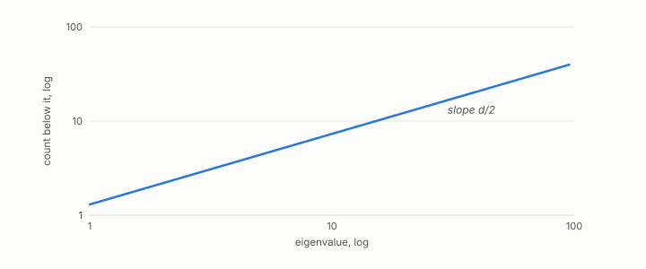

# Weyl's law

**id.** weyls-law
**kind.** concept

## definition

The asymptotic rule for how the number of eigenvalues of a continuum Laplacian below a value grows with that value, whose exponent reveals the dimension of the space. Reading it from a finite graph needs the conditions under which the graph Laplacian converges. Equation 0.31.

**Example.** On a surface, dimension two, the eigenvalue count grows linearly with the value; on a curve, as the square root.

## equation

Book equation 0.31.

    N(\lambda)=\#\{k:\lambda_k\le\lambda\}\ \sim\ C_d\,\lambda^{d/2}.

Book equation 9.2.

    N(\lambda)=\#\{k:\lambda_k\le\lambda\}\ \sim\ C_d\,\lambda^{d/2}\qquad\Rightarrow\qquad d=2\,\frac{d\log N}{d\log\lambda}.

## conditions

- An asymptotic statement about the continuum Laplacian. The number of eigenvalues below a value grows like that value to the power of half the dimension, so the dimension is in the exponent and is read from the slope of the count against the value on log axes. The Lean file checks that arithmetic and not the law.
- Carrying it to a finite neighbourhood graph needs sampling, graph-construction, normalization, and scaling conditions under which the graph Laplacian converges, and only the low part of the spectrum is read. The recognizer's battery recovered dimensions of 1.81, 2.80, and 1.74 on three sealed templates under those conditions and against a finite list.

Conditions are curated in `entries.toml` rather than read from a record.

## ledger

none

## first stated

Weyl, 1911, as chapter 0 section 0.15 of *Data Mining as Observation* states it, with the program's dimension reading in `geometric-observation/chapters/ch11_the_recognizer.md:1-95`.

## measurements

| Where the book states it | Numbers, as the book's sources table records them | Source |
|---|---|---|
| chapter 9 section 9.2 | the recognizer's mechanism, low multiplets and angular distances, dimension before shape by Weyl's law, refusal, the growth gotcha | [`geometric-observation/chapters/ch11_the_recognizer.md:1-95`](https://github.com/ahb-sjsu/geometric-observation/blob/aec4c97/chapters/ch11_the_recognizer.md#L1-L95) |

## failures and corrections

none

## invariance envelope

none declared

## machine checked

[`lean/DataMiningAsObservation/IntrinsicDimension.lean`](https://github.com/ahb-sjsu/observation-data-mining/blob/95af30c/lean/DataMiningAsObservation/IntrinsicDimension.lean), theorems `log_weyl`, `dimension_from_slope`, `weyl_double`, at observation-data-mining 95af30c; what the check covers is stated in the book's [appendix C](https://github.com/ahb-sjsu/observation-data-mining/blob/95af30c/chapters/machine_checked.md).

## used in

*Data Mining as Observation* chapters 0, 9.

## related

intrinsic-dimension, manifold, laplacian, multiplet, recognizer

## see also

Book equations stated beside the entry's terms, not defining it: 0.19.

Ledger rows that cite the entry's records without naming it: GO-3.

Sources-table rows that share a record with the entry without naming it: chapter 9 section 9.2.

## status

Generated 2026-09-09 by `encyclopedia/generate.py`; book at observation-data-mining 95af30c; the commit of every record is listed in the encyclopedia's provenance.
