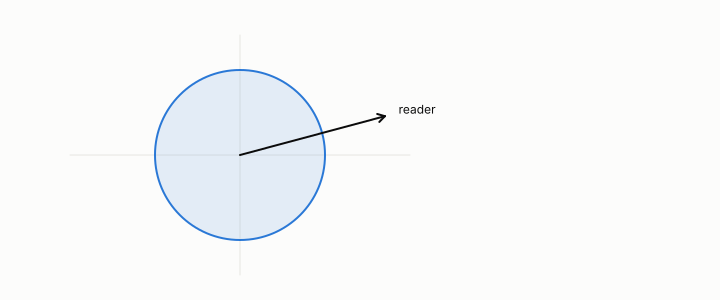

# whitening

**id.** whitening
**kind.** concept

## definition

Rescaling centred data by the inverse square root of a positive-definite covariance, or a pseudoinverse on its support, so that the covariance becomes the identity. Euclidean distance after whitening is Mahalanobis distance before it. Equation 0.6.

## equation

Book equation 0.6.

    x_{\mathrm w}=\Sigma^{-1/2}(x-\mu),\qquad \Sigma^{-1/2}=\sum_i\lambda_i^{-1/2}\,v_i v_i^{\top}.

## conditions

- Rescaling centred data by the inverse square root of its covariance, so that the covariance becomes the identity. It needs a positive-definite covariance, or a pseudoinverse restricted to the covariance's support, and after it every direction has variance one.
- Euclidean distance after whitening equals Mahalanobis distance before it, so whitening changes which reader the Euclidean reader is and not what the data holds. The whitened code won at every budget on the whale corpus, 0.83, 0.85, 0.97 against 0.41, 0.80, 0.89.

Conditions are curated in `entries.toml` rather than read from a record.

## ledger

none

## first stated

Chapter 0 section 0.2 of *Data Mining as Observation*, with the program's whitened code in Volume 14 chapter 8, `geometric-observation/chapters/ch08_value.md:84-97`.

## measurements

| Where the book states it | Numbers, as the book's sources table records them | Source |
|---|---|---|
| chapter 2 section 2.5 | whitened code wins at every budget | [`geometric-observation/chapters/ch08_value.md:84-97`](https://github.com/ahb-sjsu/geometric-observation/blob/d1f8988/chapters/ch08_value.md#L84-L97) |
| chapter 4 section 4.3 | whitened code on whale 0.83, 0.85, 0.97 vs 0.41, 0.80, 0.89 | [`geometric-observation/chapters/ch08_value.md:84-97`](https://github.com/ahb-sjsu/geometric-observation/blob/d1f8988/chapters/ch08_value.md#L84-L97) |

## failures and corrections

none

## machine checked

`lean/DataMiningAsObservation/Whitening.lean`, theorems `whiten_unit_variance`, `whiten_sq_sum`, at observation-data-mining 08b4794.

## used in

*Data Mining as Observation* chapters 0, 2, 4, 10.

## related

mahalanobis-distance, identity-reader, read-operator, water-filling

## see also

Book equations stated beside the entry's terms, not defining it: 0.5.

Ledger rows that cite the entry's records without naming it: GO-2 (neg. half: not reconstruction).

## status

Generated 2026-09-06 by `encyclopedia/generate.py`; book at observation-data-mining 08b4794; the commit of every record is listed in the encyclopedia's provenance.
