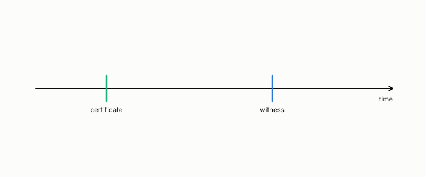

# witness

**id.** witness
**kind.** concept

## definition

An independent measurement of whether a certificate's claim was true. Chapter 13.

**Example.** The witness read the replica's actual position where the certificate had said fresh, and that disagreement is one false clear.

## equation

Book equation 0.26.

    \mathrm{FC}=\Pr\big[W\ \text{refutes}\ \big|\ \mathcal C_t\ \text{clears}\big],\qquad \text{coverage}=\Pr\big[\mathcal C_t\ \text{clears}\big].

Book equation 13.1.

    \mathrm{FC}=\Pr\big[W\ \text{refutes}\ \big|\ \mathcal C_t\ \text{clears}\big],\qquad d_O(\Delta)=\operatorname{tr}\big(P_C\,M_{\mathrm{drift}}(\Delta)\big),\qquad M_{\mathrm{drift}}(\Delta)=\mathbb E\big[\delta_\Delta\delta_\Delta^{\top}\big].

## conditions

- A witness is independent of the certificate it grades. A certificate that grades itself has no witness.
- The witness is the consumer's own outcome or a measurement of it, so the same certificate has a different witness for each consumer, as the hot and cold readers of one replica show.

Conditions are curated in `entries.toml` rather than read from a record.

## ledger

none

## first stated

Volume 14, chapter 19, `geometric-observation/chapters/ch19_the_certificate_that_ages.md:61-76`, and the freshness program's umbrella document `observation-theory-campaigns/experiments/FRESHNESS-PROGRAM.md`.

## measurements

From `observation-theory-campaigns/experiments/DATABASE-FRESHNESS-TRACK.md` at 80d1414.

- line 23. XPROTO-PG (analysis/pgrep); Postgres, recovery_min_apply_delay; WAL LSN; ~0.50 → ~0.06
- line 24. XPROTO-MG (analysis/mongo); MongoDB delayed secondary; oplog ts; ~0.47 → ~0.03
- line 25. XPROTO-PGX (analysis/pgx); production PG, netem lag; WAL LSN, pg_stat_statements footprint; ~0.47 → ~0.02
- line 27. XPROTO-ZK (analysis/zk); ZooKeeper 3.9 ensemble; zxid, sync(); hot 0.99 / cold 0.01, witnessed 0.0

From `observation-theory-campaigns/experiments/RADIO-FRESHNESS-TRACK.md` at 80d1414.

- line 25. XPROTO-CSI (analysis/csi); CQI → MCS; HARQ; 0.34–0.37 → 0.10 (OLLA); ✅ 08-23
- line 26. XPROTO-BEAM (analysis/beam); mmWave beam index; HARQ; 0.31 → 0.02 (BFR); ✅ 08-23
- line 27. XPROTO-AICSI (analysis/aicsi); neural-CSI recon (turboquant bridge); precoder/HARQ; recon wins yet 0.28 → 0.13; ✅ 08-23, scope-corrected 08-25 ⚠️
- line 28. XPROTO-HO (analysis/ho); RSRP → serving cell; RLF; 0.31–0.44 → 0.09–0.12; ✅ 08-23
- line 30. XPROTO-PHY (analysis/phy); PMI / RI / TA; HARQ; 0.27–0.42 → 0.055–0.13; ✅ 08-24

## failures and corrections

none

## invariance envelope

none declared

## machine checked

[`lean/DataMiningAsObservation/Certificate.lean`](https://github.com/ahb-sjsu/observation-data-mining/blob/95af30c/lean/DataMiningAsObservation/Certificate.lean), theorems `falseClear_mul_coverage`, `coverage_empty`, `falseClear_mem_unit`, `minOverStrata_passes_iff`, `minOverStrata_le_weighted_mean`, at observation-data-mining 95af30c; what the check covers is stated in the book's [appendix C](https://github.com/ahb-sjsu/observation-data-mining/blob/95af30c/chapters/machine_checked.md).

## used in

*Data Mining as Observation* chapters 0, 12, 13, 14.

## related

certificate, false-clear-rate, coverage

## see also

Sources-table rows that share a record with the entry without naming it: chapter 12 section 12.6, chapter 13 section 13.3, chapter 13 section 13.4.

## status

Generated 2026-09-08 by `encyclopedia/generate.py`; book at observation-data-mining 95af30c; the commit of every record is listed in the encyclopedia's provenance.
