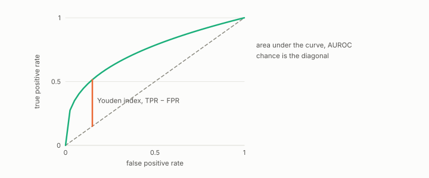

# Youden index

**id.** youden-index
**kind.** instrument

## definition

True positive rate minus false positive rate at a threshold, whose maximum over thresholds is the pointwise ceiling that prunes the formula search. Chapter 5 section 5.4.

**Example.** True positive rate 0.75 and false positive rate 0.25 give Youden index 0.5.

## equation

Book equation 5.4.

    \begin{gathered} F_1^{\max}\ \le\ \sup_{t\in[J,\,1]}\ \frac{2t\pi}{t\pi+\pi+(t-J)(1-\pi)},\qquad J=\max_{\tau}\big(\mathrm{TPR}-\mathrm{FPR}\big),\qquad \pi=\text{prevalence}, \\ J\le 2A-1\ \text{when the ROC curve is concave, and not in general.} \end{gathered}

## conditions

- True positive rate minus false positive rate at a threshold, whose maximum over thresholds bounds the best F1 the score can reach at any threshold. The bound is exact for concave ROC curves and fails for a curve at AUROC 0.75.
- The pointwise ceiling on a node of the formula search is proved, and using it to prune the node's descendants is a heuristic that missed the optimum on two of five datasets in the rerun.

Conditions are curated in `entries.toml` rather than read from a record.

## ledger

none

## first stated

Youden, index for rating diagnostic tests, 1950, as chapter 5 section 5.4 of *Data Mining as Observation* reads it, with the pointwise ceiling in `theory-radar/paper/astar_paper.tex:94-110`.

## measurements

none

## failures and corrections

none

## machine checked

[`lean/DataMiningAsObservation/YoudenF1.lean`](https://github.com/ahb-sjsu/observation-data-mining/blob/95af30c/lean/DataMiningAsObservation/YoudenF1.lean), theorems `f1_eq`, `f1_le_of_youden`, `auroc_eq`, `youden_eq`, `youden_exceeds_auroc_form`, at observation-data-mining 95af30c; what the check covers is stated in the book's [appendix C](https://github.com/ahb-sjsu/observation-data-mining/blob/95af30c/chapters/machine_checked.md).

## used in

*Data Mining as Observation* chapters 5.

## related

roc-curve, auroc, f1, safe-pruning, formula-classifier

## see also

Book equations stated beside the entry's terms, not defining it: 0.28, 0.38.

Sources-table rows that share a record with the entry without naming it: chapter 5 section 5.4, chapter 6 section 6.3.

## status

Generated 2026-09-07 by `encyclopedia/generate.py`; book at observation-data-mining 95af30c; the commit of every record is listed in the encyclopedia's provenance.
